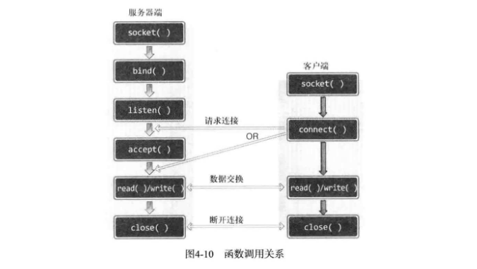

# ch04 基于TCP的服务器端/客户端

## 1. 理解TCP和UDP

略。。。

## 2. 实现基于TCP的服务器端和客户端

### *1. TCP服务器端的默认函数调用顺序*

1. `socket` 创建套接字
2. `bind` 分配套接字地址
3. `listen` 等待连接请求状态
4. `accept` 允许连接
5. `read/write` 数据交换
6. `close` 断开连接

### *2. 进入等待请求连接状态*

我们已经调用 `bind` 函数给套接字分配了地址，接下来就要通过调用 `listen` 函数进入等待连接请求状态。只有调用了 `listen` 函数，客户端才能进入可发出连接请求的状态。换言之，这时客户端才能调用 `connect` 函数（若提前调用将发生错误）。

```c
#include <sys/types.h>          /* See NOTES */
#include <sys/socket.h>
int listen(int sockfd, int backlog);
// 成功时返回0，失败时返回-1
// 详见手册
```

*sockfd* 为希望进入等待连接请求状态的套接字文件描述符，传递的描述符套接字参数成为服务器端套接字（监听套接字）。*backlog* 连接请求等待队列的长度，若为5，则队列长度为5，表示最多使5个连接请求进入队列。

### *3. 受理客户端连接请求*

```c
#include <sys/types.h>          /* See NOTES */
#include <sys/socket.h>
int accept(int sockfd, struct sockaddr *addr, socklen_t *addrlen);
```

*sock* 服务器端套接字的文件描述符，*addr* 保存发起连接请求的客户端地址信息的变量地址值，调用函数后向传递来的地址变量参数填充客户端地址信息。*addrlen* 第二个参数 *addr* 结构体的长度，但是存有长度的变量地址值。函数调用完成后，该变量即被填入客户端地址长度。  
`accept` 函数受理连接请求等待队列中待处理的客户端连接请求。函数调用成功时，`accept` 函数内部将产生用于数据I/O的套接字，并返回其文件描述符。需要强调的是，套接字是自动创建的，并自动与发起连接请求的客户端建立连接。

回顾 Hello World服务器端：
[hello_server.c](../ch01-理解网络编程和套接字/hello_server.c)

### *4. TCP客户端的默认函数调用顺序*

1. `socket` 创建套接字
2. `connect` 请求连接
3. `read/write` 交换数据
4. `close` 断开连接

与服务器端相比，区别就在于 "请求连接"，它是创建客户端套接字后向服务器端发起的连接请求。服务器端调用 `listen` 函数后创建连接请求队列，之后客户端即可请求连接。

```c
#include <sys/types.h>          /* See NOTES */
#include <sys/socket.h>
int connect(int sockfd, const struct sockaddr *addr,
                socklen_t addrlen);
// 成功时返回0，失败时返回-1
// 详见手册
```

*sock* 客户端套接字文件描述符，*servaddr* 保存目标服务器地址信息的变量地址值，*addrlen* 以字节为单位传递第二个结构体参数 *servaddr* 的地址变量长度。  

客户端调用 `connect` 函数后，发生以下情况之一才会返回（完成函数调用）。

- 服务器端接收连接请求。
- 发生断网等异常情况而中断连接请求。

需要注意，所谓的 "接收连接" 并不意味着服务器端调用 `accept` 函数，其实是服务器端把连接请求信息记录到等待队列。因此，`connect` 函数返回后并不立即进行数据交换。

> **知识补给站：** 客户端套接字何时、何地、如何分配地址呢？

- 何时？ 调用 `connect` 函数时
- 何地？ 操作系统内核
- 如何？ IP用计算机（主机）的IP，端口随机

客户端的IP地址和端口号在调用 `connect` 函数时自动分配，无需调用标记的 `bind` 函数进行分配。

回顾Hello World客户端：[hello_client.c](../ch01-理解网络编程和套接字/hello_client.c)



服务器端创建套接字后连续调用 `bind`、`listen` 函数进入等待状态，客户端通过调用 `connect` 函数发起连接请求。需要注意的是，客户端只能等到服务器端调用 `listen` 后才能调用 `connect` 函数。同时要清楚，客户端调用 `connect` 函数前，服务器端有可能率先调用 `accept` 函数，当然，此时服务器端在调用 `accept` 函数时进入阻塞状态，直到客户端调用 `connect` 函数为止。

## 3. 实现迭代服务器端/客户端

本节编写回声服务器端/客户端。

### *1. 迭代回声服务器端/客户端*

基本运作方式如下：

- 服务器端在同一时刻只与一个客户端相连，并提供回声服务。
- 服务器端依次向5个客户端提供服务并退出。
- 客户端接收用户输入的字符串并发送到服务器端。
- 服务器端将接收到的字符串数据传回客户端，即回声。
- 客户端输入q退出。

[echo_server.c](./echo_server.c)
[echo_client.c](./echo_client.c)

### *2. 回声客户端存在的问题（TCP不存在数据边界）*

```c
write(sock, message, strlen(message));
str_len = read(sock, message, BUF_SIZE);
```

以上代码有个错误假设，"每次调用 `read`、`write` 函数时都会以字符串为单位执行实际的I/O操作"。当然，每次调用 `write` 函数都会传递一个字符串，因此这种假设在某种程度上也算合理。但是 "TCP不存在数据边界"（[参见第二章](../ch02-套接字类型与协议设置/README.md#3-tcp套接字示例)）。上述客户端是基于TCP的，因此，多次调用 `write` 函数传递的字符串有可能一次性传递到服务器端。此时客户端客户端有可能从服务器端收到多个字符串，这不是我们希望看到的结果。还需考虑服务器端的以下情况："字符串太长，需要分2个数据包发送"。服务器端希望通过一次 `write` 函数调用传输数据，但如果数据太大，操作系统有可能把数据分成多个数据包发送到客户端。另外，在此过程中，客户端有可能在尚未收到全部数据包时就调用 `read` 函数。所有的这些问题都源自TCP的数据传输特性。那该如何解决呢？[参见第5章](../ch05-基于TCP的服务器端和客户端_2/READMD.md)。
