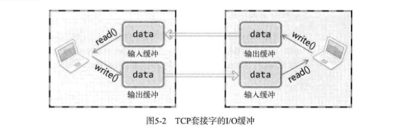

# ch05 基于TCP的服务器端/客户端（2）

## 1. 回声客户端的完美实现

### *1. 回声服务器端没有问题，只有回声客户端有问题？*

问题不在服务器端，而在客户端。先回顾一下回声服务器端的I/O相关代码。

```c
while ((str_len = read(clnt_sock, message, BUF_SIZE)) != 0)
    write(clnt_sock, message, str_len);
```

接着回顾回声客户端的代码。

```c
while (1) 
{ 
    fputs("Input Message(q/Q to quit): ", stdout);
    fgets(message, BUF_SIZE, stdin);
    if(! strcmp(message, "q\n") || ! strcmp(message, "Q\n")) 
        break;
    write(sock, message, strlen(message));
    str_len = read(sock, message, BUF_SIZE);
    // message [str_len] = 0;
    printf("Message from server: %s\n", message);
}
```

二者都在循环调用 `read` 或 `write` 函数。实际上回声客户端会100%接收自己传输的数据，只不过接收数据时的单位有些问题。回声客户端传输的是字符串，而且是通过调用 `write` 函数一次性发送的，之后还调用一次 `read` 函数，期待着接收自己传输的数据。这就是问题所在。

> "既然回声客户端会收到所有字符串数据，是否只需多等待一会儿？过一段时间后再调用 `read` 函数是否可以一次性读取所有的字符串数据？"

的确，过一段时间后即可接收，但需等多久？要等10分钟嘛？这不现实，理想的客户端应在收到字符串数据时立即读取并输出。

### *2. 回声客户端问题解决方法*

解决 [第4章的问题](../ch04-基于TCP的服务器端和客户端_1/READMD.md#2-回声客户端存在的问题tcp不存在数据边界)。  

**解法一：** 因为回声客户端可以提前确定接收数据的大小，那我们就可以计算我们已经接收的数据直到达到预期即可。

[echo_client2.c](./echo_client2.c)

```c
str_len = write(sock, message, strlen(message));
recv_tot = 0;
while (recv_tot < str_len) 
{ 
    recv_cur = read(sock, message, BUF_SIZE - 1);
    if(recv_cur == -1) 
        error_handling("write() error");
    recv_tot + = recv_cur;
} 
message [str_len] = 0;
printf("Message from server: %s\n", message);
```

### *3. 如果问题不在于回声客户端：定义应用层协议*

回声客户端可以提前知道接收的数据长度，但我们应该认识到，更多情况下这不太可能。既然如此，若无法预知接收数据长度时应如何收发数据？此时需要的就是应用层协议的定义。之前的回声服务器/客户端中定义了如下协议。"收到Q就立即终止连接" 同样，收发数据过程中也需要定好规则（协议）以表示数据的边界，或提前告知收发数据的大小。服务器端/客户端实现过程中逐步定义的这些规则集合就是应用层协议。  

下面编写程序以体验应用层协议的定义过程。该程序中，服务器端从客户端获得多个数字和运算符信息。服务器端收到数字后对其进行加减乘除运算，然后把结果传回客户端。例如，向服务器传递3、5、9的同时请求加法运算，则客户端收到3+5+9的运算结果。

该程序设计的大致协议如下：

- 客户端连接到服务器端后以1字节整数形式传递待算数字个数。
- 客户端向服务器端传递的每个整型数据占用4个字节。
- 传递整数型数据后接着传递运算符。运算符信息占用1字节。
- 选择字符+、-、*之一传递。
- 服务器端以4字节整数型向客户端传回运算结果。
- 客户端得到运算结果后终止与服务器端的连接。

这种程度的协议相当于实现了一半程序。

[op_client.c](./op_client.c) [op_server.c](./echo_server.c)

## 2. TCP原理

### *1. TCP套接字中的I/O缓冲*

如前所述，TCP套接字的数据收发无边界。服务器端即使调用1次 `write` 函数传输40字节的数据，客户端也有可能通过4次 `read` 函数调用每次读取10字节。服务器端一次性传输了40字节，而客户端可以分批次接收这是因为缓冲的存在。  



实际上，`write` 函数调用后并非立即传输数据，`read` 函数调用后也并非马上接收数据。`write` 函数调用的瞬间，数据将移至输出缓冲；`read` 函数调用瞬间，从输入缓冲读取数据。  
这些I/O缓冲特性如下：

- I/O缓冲在每个套接字中单独存在
- I/O缓冲在创建套接字时自动生成
- 即使关闭套接字也会继续传递输出缓冲中遗留的数据
- 关闭套接字将丢失输入缓冲中的数据
