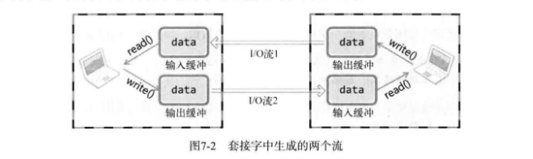

# ch07 优雅地断开套接字连接

## 1. 基于TCP的半关闭

### *1. 单方面断开连接带来的问题*

Linux的 `close` 函数意味着完全断开连接。完全断开连接不仅指无法传输数据，而且也不能接收数据。

### *2. 套接字和流*

两台主机通过套接字建立连接后进入可交换数据的状态，又称 "流形成的状态"。也就是把建立套接字后可交换数据的状态看作一种流。在套接字的流中，数据只能向一个方向流动。因此，为了进行双向通信，需要如下图的2个流。



一旦两台主机建立了套接字连接，每个主机就会拥有单独的输入流和输出流。当然，其中一个主机的输入流和另一个主机的输出流相连，而输出流和另一个主机的输入流相连。本章所谓的优雅地断开，只断开其中的一个流，而非同时断开两个流。

### *3. 针对优雅断开的 `shutdown` 函数*

```c
NAME
    shutdown - shut down part of a full-duplex connection
SYNOPSIS
    #include <sys/socket.h>
    int shutdown(int sockfd, int how);
// 成功时返回0，失败时返回-1
// 详见手册
```

- *sockfd* ：需要断开的套接字文件描述符
- *how* ：传递断开方式信息

第二个参数决定断开连接的方式，有以下取值：

- SHUT_RD ：断开输入流
- SHUT_WR ：断开输出流
- SHUT_RDWR ：同时断开I/O流。

SHUT_RD，断开输入流，套接字无法接收数据，输入缓冲中收到的数据也会被抹除，而且无法调用输入相关函数。  
SHUT_WR，断开输出流，无法传输数据。但如果输出缓冲中还有未传输的数据，则传递给目标主机。  
SHUT_RDWR，中断I/O流，相当于分两次分别调用上面两个函数。

### *4. 为何需要半关闭*

调用 `shutdown` 函数，只关闭服务器的输出流（半关闭）。这样既可以发送EOF，同时又保留了输入流。可以接收对方的数据。

### *5. 基于半关闭的文件传输程序*

[file_server.c](./file_server.c) [file_client.c](./file_client.c)