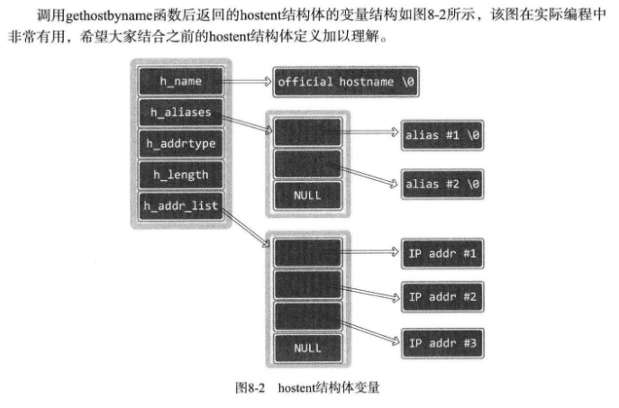

# ch08 域名及网络地址

## 1. 域名系统

略

## 2. IP地址和域名之间的转换

### *1. 程序中有必要使用域名吗？*

IP地址比域名发生变更的概率要高，所以利用IP地址编写程序并非上策。一旦注册域名可能永久不变，因此利用域名编写程序会更好一点。这样，每次运行程序时根据域名获取IP地址，再接入服务器，这样程序就不会依赖于服务器IP地址了。所以说，程序中也需要IP地址和域名之间的转换函数。

### *2. 利用域名获取IP地址*

使用以下函数可以通过传递字符串格式的域名获取IP地址。

```c
#include <netdb.h>
struct hostent *gethostbyname(const char *name);
// 成功时返回 hostent 结构体地址，失败时返回NULL指针
```

`hostent` 结构体定义如下：

```c
struct hostent
{
    char * h_name; // Official name
    char ** h_aliases; //alias list
    int h_addrtype; // host address type
    int h_length; // address length
    char ** h_addr_list; //address list
}
```

下面简要说明上述结构体各成员。

- h_name
该变量中存有官方域名（Official domain name）。官方域名代表某一主页，但实际上，一些著名公司的域名并未用官方域名注册。

- h_aliases
可以通过多个域名访问同一主页。同一IP可以绑定多个域名，因此，除官方域名外还可以指定其他域名。这些信息可以通过 h_aliases 获得

- h_addrtype
`gethostbyname` 函数不仅支持IPv4，还支持IPv6。因此可以通过此变量获取保存在h_addr_list的IP地址的地址族信息。若是IPv4，则此变量存有AF_INET。

- h_length
保存IP地址长度。若是IPv4地址，则保存4。IPv6时，保存16。

- h_addr_list
这是最重要的成员。通过此变量以整数形式保存域名对应的IP地址。另外，用户较多的网站有可能分配多个IP给同一域名，利用多个服务器进行负载均衡。此时同样可以通过此变量获取IP地址信息。



[gethostbyname.c](./gethostbyname.c)

```bash
lxc@Lxc:~/C/tcpip_src/ch08-域名及网络地址$ bin/gethostbyname www.baidu.com
official name: www.a.shifen.com
Aliases 1: www.baidu.com
Address type: AF_INET
IP addr 1: 39.156.66.14
IP addr 2: 39.156.66.18
```

### *3. 利用IP地址获取域名*

`gethostbyname` 利用IP地址获取域相关信息。

```c
SYNOPSIS
#include <sys/socket.h>       /* for AF_INET */
struct hostent *gethostbyaddr(const void *addr,
                                socklen_t len, int type);
// 成功时返回 hostent 结构体变量地址，失败时返回NULL指针。
```

- *addr*  ：含有IP地址信息的 in_addr 结构体（参见[第三章](../ch03-地址族与数据序列/README.md#1-表示ipv4地址的结构体)）指针。为了同时传递IPv4地址之外的其他信息，该变量的类型声明为char指针

- *len* ：向第一个参数传递地址信息的字节数，IPv4时为4，IPv6时为16。

- *family* ：传递地址族信息，IPv4 时为AF_INET，IPv6时为AF_INET6。

[gethostbyaddr.c](./gethostbyaddr.c)

