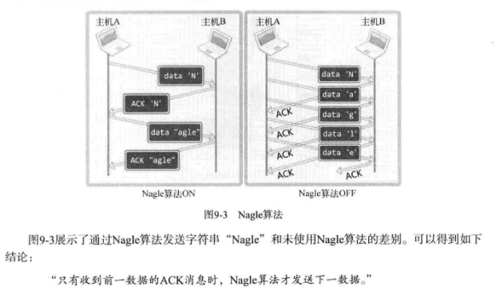

# ch09 套接字的多种选项

## 1. 套接字可选项和I/O缓冲大小

### *1. 套接字的多种可选项*

我们之前写的程序都是创建好套接字后直接使用的，此时通过默认的套接字特性进行数据通信。

|协议层|选项名|读取|设置|
| :-----------: | :---------------------------------: | :--: | :--: |
|SOL_SOCKET|SO_SNDBUF|O|O|
||SO_RCVBUF|O|O|
||SO_REUSEADDR|O|O|
||SO_KEEPALIVE|O|O|
||SO_BROADCAST|O|O|
||SO_DONTROUTE|O|O|
||SO_OOBINLINE|O|O|
||SO_ERROR|O|X|
||SO_TYPE|O|X|
|IPPROTO_IP|IP_TOS|O|O|
||IP_TTL|O|O|
||IP_MULTICAST_TTL|O|O|
||IP_MULTICAST_LOOP|O|O|
||IP_MULTICAST_IF|O|O|
|IPPROTO_TCP|TCP_KEEPALIVE|O|O|
||TCP_NODELAY|O|O|
||TCP_MAXSEG|O|O|

从上表可以看出，套接字可选项是分层的。IPPROTO_IP层可选项是IP协议相关事项，IPPROTO_TCP层可选项是TCP协议相关的事项，SOL_SOCKET层是套接字相关的通用可选项。

### *2. `getsockopt` & `setsockopt`*

可选项的读取和设置可以通过如下两个函数完成。

```c
SYNOPSIS
#include <sys/types.h>          /* See NOTES */
#include <sys/socket.h>
int getsockopt(int sockfd, int level, int optname,
              void *optval, socklen_t *optlen);
// 成功时返回0，失败时返回-1。
```

- *sock* ：用于待查看选项的套接字文件描述符。
- *level* ：要查看的可选项协议层
- *optname* ：要查看的可选项名
- *optval* ：保存查看结果的缓冲地址值
- *optlen* ：向第四个参数 *optval* 传递的缓冲大小。调用函数后，该变量中保存通过第四个参数返回的可选项信息的字节数。

下面是更改可选项的函数。

```c
SYNOPSIS
#include <sys/types.h>          /* See NOTES */
#include <sys/socket.h>
int setsockopt(int sockfd, int level, int optname,
                      const void *optval, socklen_t optlen);
// 成功时返回0，失败时返回-1。
```

- *sock* ：用于更改可选项的文件描述符
- *level* ：要更该的可选项协议层
- *optname* ：要更该的可选项名
- *optval* ：保存要更该的选项信息的缓冲地址值
- *optlen* ：向第四个参数传递的可选项信息的字节数

下列示例用协议层为SOL_SOCKET，名为SO_TYPE的可选项查看套接字类型（TCP或UDP）。关于 `setsockopt` 函数的调用方法会在其他示例中给出。

[sock_type.c](./sock_type.c)

```bash
lxc@Lxc:~/C/tcpip_src/ch09-套接字的多种可选项$ bin/sock_type 
SOCK_STREAM: 1
SOCK_DGRAM: 2
Socket type one: 1
Socket type two: 2
```

### *3. `SO_SNDBUF` & `SO_RCVBUF`*

`SO_SNDBUF` 是输出缓冲大小相关可选项，`SO_RCVBUF` 是输入缓冲大小相关可选项。用这两个可选项既可以读取当前I/O缓冲大小，也可以进行更改。

[get_buf.c](./get_buf.c)

```bash
lxc@Lxc:~/C/tcpip_src/ch09-套接字的多种可选项$ bin/get_buf 
Input buffer size: 131072
Output buffer size: 16384
```

[set_buf.c](./set_buf.c)

```bash
lxc@Lxc:~/C/tcpip_src/ch09-套接字的多种可选项$ bin/set_buf 
Input buffer size: 20480
Output buffer size: 204800
```

在设置缓冲的大小时输出的结果和我们设置的结果完全不同，这很合理。缓冲大小的设置需谨慎处理，因此不会完全按照我们的要求进行，只是通过调用 `setsockopt` 函数向系统传递我们的请求。

## 2. `SO_REUSEADDR`

本节讲解可选项及其相关的 `Time-wait` 状态。

### *1. 发生地址分配错误（Binding Error）*

当服务器端先断开连接时，使用同一端口号重新运行服务器端时，会输出 "bind() error" 的消息。即服务器端无法立即使用同一端口重新运行。再等大约3分钟后，即可使用该端口重新运行服务器。

### *2. Time-wait状态*

先断开连接的主机在断开连接时会经过 `Time-wait` 状态（四次挥手不再赘述，你应该很熟悉才对）。套接字处于 Time-wait 过程时，相应的端口是正在使用的状态，所以在重新使用该端口时会发生 "bind() error" 的错误。

> 客户端套接字不会经过 Time-wait 状态吗？

不管是服务器端还是客户端，套接字都会有 Time-wait 状态。先断开连接的套接字必然会经过Time-wait过程。但无需考虑客户端Time-wait状态。因为客户端套接字的端口是任意指定的。与服务器端不同，客户端每次运行时都会动态分配端口号，因此无需关注Time-wait状态。

### *3. 地址再分配*

Time-wait看似重要，但并不讨人喜欢。  
我们可以在套接字的可选项中更改 `SO_REUSEADDR` 的状态，将Time-wait状态下的套接字端口号重新分配给新的套接字。`SO_REUSEADDR` 的默认值为0（假），这意味着无法分配Time-wait状态下的套接字端口号。因此需要将这个值改为1。

[reuseaddr_eserver.c](./reuseaddr_eserver.c)

```bash
# 进程1
lxc@Lxc:~/C/tcpip_src/ch09-套接字的多种可选项$ bin/reuseaddr_eserver 9999
123 # 这个123是来自客户端的123
^C

# 进程2
lxc@Lxc:~/C/tcpip_src/ch09-套接字的多种可选项$ bin/echo_client 127.0.0.1 9999
Connected...........
Input message(Q to quit): 123
Message from server: 123
Input message(Q to quit): q

# 进程1
lxc@Lxc:~/C/tcpip_src/ch09-套接字的多种可选项$ bin/reuseaddr_eserver 9999 # 注意这里重新使用9999的端口号，并未出现绑定错误的消息。
123 # 这个123也是来自客户端的123

# 进程2
lxc@Lxc:~/C/tcpip_src/ch09-套接字的多种可选项$ bin/echo_client 127.0.0.1 9999
Connected...........
Input message(Q to quit): 123
Message from server: 123
Input message(Q to quit): q
```

## 3. `TCP_NODELAY`

### *1. Nagle 算法*

为防止因数据包过多而发生网络过载，Nagle算法在1984年就诞生了，应用于TCP层。



TCP套接字默认使用Nagle算法，因此会最大限度地进行缓冲，直到收到ACK。  

但Nagle算法并不是什么时候都适用。根据传输数据的特性，网络流量未受太大影响时，不使用Nagle算法要比使用它时传输速度更快。最典型的是传输大文件数据时。将文件数据传入输出缓冲不会花太多时间，因此，即便不使用Nagle算法，也会在装满输出缓冲时传输数据包。这不仅不会增加数据包的数量，反而会在无需等待ACK的前提下连续传输，因此可以大大提高传输速度。   

一般情况下，不使用Nagle算法可以提高传输速度。但如果无条件放弃使用Nagle算法，就会增加过多的网络流量，反而会影响传输。因此。未准确判断数据特性时不应禁用Nagle算法。

### *2. 禁用Nagle算法*

[get_nagle.c](./get_nagle.c)

```bash
TCP_NODELAY: 0
After setting, the value of TCP_NODELAY is: 1
```