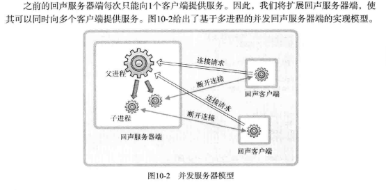
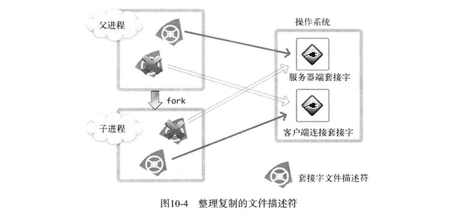
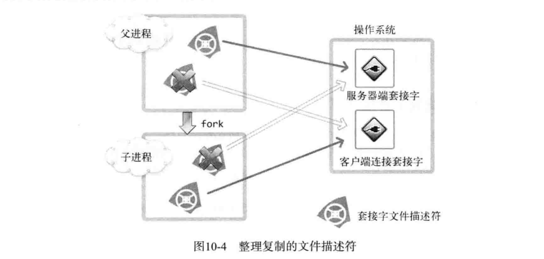
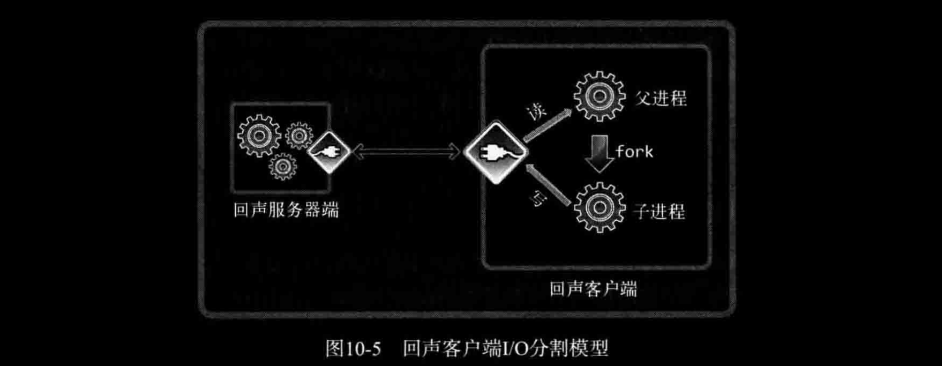
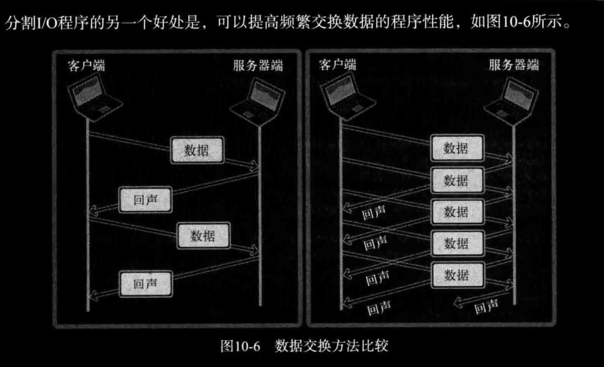

# ch10 多进程服务器端

## 1. 进程的概念及应用

### *1. 两种类型的服务器端*

。。。略

### *2. 并发服务器端的实现方法*

下面列出具有代表性的并发服务器端实现模型和方法。

- 多进程服务器：通过创建多个进程提供服务
- 多路复用服务器：通过捆绑并统一管理I/O对象提供服务
- 多线程服务器：通过生成与客户端等量的线程提供服务

### *3. 理解进程*

略

### *4. 通过调用 `fork` 函数创建进程*

```c
NAME
fork - create a child process
SYNOPSIS
#include <sys/types.h>
#include <unistd.h>
pid_t fork(void);
// 成功时返回进程ID，失败时返回-1
```

`fork` 函数将创建调用的进程副本。也就是说，并非根据完全不同的程序创建进程，而是复制正在运行的、调用 `fork` 函数的进程。因为通过同一个进程、复制相同的内存空间，之后的程序根据 `fork` 函数的返回值加以区分。

- 父进程：`fork` 函数返回子进程ID。
- 子进程：`fork` 函数返回0。

[fork.c](./fork.c)

```bash
lxc@Lxc:~/C/tcpip_src/ch10-多进程服务器端$ bin/fork 
Parent Proc: gval: 9, lval: 23
Child Proc: gval: 13, lval: 27
# 从运行结果可以看出，调用 fork 函数后，父子进程拥有完全独立的内存结构。
```

## 2. 进程和僵尸进程

`fork` 函数产生子进程的终止方式。

- 传递参数并调用 `exit` 函数
- main 函数中执行 `return` 语句并返回值

向 `exit` 函数传递的参数值和main函数的 `return` 语句返回的值都会传递给操作系统。而操作系统不会销毁子进程，直到把这些值传递给产生该子进程的父进程。处在这种状态下的进程就是僵尸进程。既然如此，此僵尸进程何时被销毁呢？***"应该向创建子进程的父进程传递子进程的 `exit` 参数值或 `return` 语句的返回值"***。如何向操作系统传递这些值呢？操作系统不会主动把这些值传递给父进程。只有父进程主动发起请求时，操作系统才会传递该值。换言之，如果父进程未主动要求获得子进程的结束状态值，操作系统将一直保存，并让子进程长时间处于僵尸状态。  
这个示例将创建僵尸进程。

[zombie.c](./zombie.c)

```c
#include <stdio.h>
#include <unistd.h>
#include <sys/types.h>

int main(int argc, char* argv[])
{
    pid_t pid = fork();

    if(pid == 0)
    {
        puts("Hi! I'm a child process\n");
    }
    else
    {
        // 输出子进程ID，通过该值可以查看子进程状态。
        printf("Child Process ID: %d\n", pid); 
        // 睡30秒觉，如果父进程终止，处于僵尸状态的子进程将同时销毁。
        // 所以，让父进程睡觉以验证僵尸进程。
        sleep(30);
    }

    if(pid == 0)
        puts("End child process");
    else
        puts("End parent process");
        
    return 0;
}
```

*下面是输出：*

```bash
lxc@Lxc:~/C/tcpip_src/ch10-多进程服务器端$ bin/zombie 
Child Process ID: 12510
Hi! I\'m a child process

End child process
End parent process

lxc@Lxc:~/C/tcpip_src/ch10-多进程服务器端$ ps au
lxc        12509  0.0  0.0   2500   512 pts/1    S+   11:21   0:00 bin/zombie
lxc        12510  0.0  0.0      0     0 pts/1    Z+   11:21   0:00 [zombie] <defunct>
lxc        12762  0.0  0.0  14592  3284 pts/2    R+   11:21   0:00 ps au
# 可以看到，PID为12510的进程状态为僵尸进程(Z+)，
# 经过30s后，PID为12509的父进程和僵尸子进程会同时销毁。
```

### *1. 销毁僵尸进程1：利用 `wait` 函数*

如前所述，为了销毁子进程，父进程应该主动请求获取子进程的返回值。

```c
NAME
       wait, waitpid, waitid - wait for process to change state
SYNOPSIS
       #include <sys/types.h>
       #include <sys/wait.h>
       pid_t wait(int *wstatus);
// 成功时返回终止的子进程ID，失败时返回-1。
```

调用此函数时如果已有子进程终止，那么子进程终止时传递的返回值（`exit` 函数的参数值，`return` 的返回值）将保存到该函数参数所指的内存空间。但函数参数指向的内存单元中还包含其他信息，因此需要以下宏分离。

- `WIFEXITED` 子进程正常终止时返回 true 
- `WEXITSTATUS` 返回子进程的返回值

也就是说，向 `wait` 函数传递变量 *wstatus* 的地址时，调用 `wait` 函数后应编写如下代码：

```c
if(WIFEXIED(wstatus)) // 是正常终止吗？
{
    puts("Normal termination");
    printf("Child pass num: %d", WEXITSTATUS(wstatus)); // 那么返回值是多少呢？
}
```

调用此函数时，如果没有已终止的子进程，那么程序将阻塞直到有子进程终止，因此需谨慎调用此函数。

[wait.c](./wait.c)

```bash
lxc@Lxc:~/C/tcpip_src/ch10-多进程服务器端$ bin/wait
Child PID: 14100
Child PID: 14101
Child send one: 3
Child send two: 7
# 你可以通过 ps au 查看确认无僵尸进程
```

### *2. 销毁僵尸进程2：使用 `waitpid` 函数*

`wait` 函数会引起程序阻塞，可以考虑使用 `waitpid` 函数。

```c
#include <sys/wait.h>
pid_t waitpid(pid_t pid, int *wstatus, int options);
// 成功时返回终止的子进程ID（或0），失败时返回-1。
```

- *pid* 等待终止的子进程的ID，若传递-1，则等待任意子进程终止；
- *wstatus*，与 `wait` 函数中的 `wstatus` 同义；
- *options*，若传递 `WNOHANG`，则即使没有子进程终止也不会进入阻塞状态，而是返回0并退出函数。

[waitpid.c](./waitpid.c)

```bash
lxc@Lxc:~/C/tcpip_src/ch10-多进程服务器端$ bin/waitpid 
sleep 3sec.
sleep 3sec.
sleep 3sec.
sleep 3sec.
sleep 3sec.
Child send 24
# 可以看出，waipid 函数并未阻塞。
```

## 3. 信号处理

"子进程到底何时终止？调用 `waitpid` 函数后要无休止的等待吗？"

父进程往往和子进程一样繁忙，因此不能只调用 `waitpid` 函数以等待子进程终止。接下来讨论解决方案。

### *1. 向操作系统求助*

信号处理（Signal Handling）机制。信号是在特定事件发生时由操作系统向进程发送的消息。为了响应该消息，执行与消息相关的自定义操作的过程称为处理或信号处理。

### *2. 信号与 `signal` 函数*

- 进程：“嘿，操作系统！如果我之前创建的子进程终止，就帮我调用 *zombie_handler* 函数。”
- 操作系统：“好的！如果你的子进程终止，我会帮你调用 *zombie_handler* 函数，你先把该函数要执行的语句编写好！”

上述对话中进程所讲的相当于“注册信号”过程，即进程发现自己的子进程结束，请求操作系统调用特定函数。该请求通过如下函数调用完成（因此称此函数为信号注册函数）。

```c
SYNOPSIS
       #include <signal.h>
       typedef void (*sighandler_t)(int);
       sighandler_t signal(int signum, sighandler_t handler);
// 为了在产生信号时调用，返回之前注册的函数指针。
```

下面给出可以在该函数中注册的部分信号和对应的常数：

- SIGALRM：已到通过调用 `alarm` 函数注册的时间
- SIGINT：输入Ctrl+C
- SIGCHLD：子进程终止

*例如：*

子进程终止时调用 *mychild* 函数。

```c
signal(SIGCHLD, mychild);
```

已到 `alarm` 函数注册的时间，调用 *timeout* 函数。

```c
signal(SIGALRM, timeout);
```

输入Ctrl+C时调用 *keycontrol* 函数。

```c
signal(SIGINT, keycontrol);
```

下面介绍 `alarm` 函数。

```c
NAME
       alarm - set an alarm clock for delivery of a signal
SYNOPSIS
       #include <unistd.h>
       unsigned int alarm(unsigned int seconds);
// 返回0或以秒为单位的距 SIGALRM 信号发生所剩的时间
```

如果调用该函数时向它传递一个正整型参数，相应时间后将产生 SIGALRM 信号。若向该函数传递0，则之前对 SIGALRM 信号的预约将取消。如果通过该函数预约信号后未指定该信号对应的处理函数，则（通过调用 `signal` 函数）终止进程，不做任何处理。

[signal.c](./signal.c)

```bash
lxc@Lxc:~/C/tcpip_src/ch10-多进程服务器端$ bin/signal 
Wait...
Time out!
Wait...
Time out!
Wait...
Time out!
lxc@Lxc:~/C/tcpip_src/ch10-多进程服务器端$ bin/signal 
Wait...
^C Ctrl+C pressed
Wait...
^C Ctrl+C pressed
Wait...
^C Ctrl+C pressed
```

调用函数的主体是操作系统，但进程处于休眠状态时无法调用函数。因此，产生信号时，为了调用信号处理器（信号处理函数），将唤醒由于调用 `sleep` 函数而进入阻塞状态的进程。而且，进程一旦被唤醒，就不会再进入休眠状态。即使还未到 `sleep` 函数中规定的时间也是如此。

### *3. 利用 `sigaction` 函数进行信号处理*

实际上现在很少使用 `signal` 函数编写程序，它只是为了保持对旧程序的兼容。`signal` 函数在UNIX系列的不同操作系统中可能存在区别，但 `sigaction` 函数完全相同。下面介绍 `sigaction` 函数，不过只会讲解可替换 `signal` 函数的部分。

```c

SYNOPSIS
       #include <signal.h>
       int sigaction(int signum, const struct sigaction *act,
                     struct sigaction *oldact);
// 成功时返回0，失败时返回-1
```

- *signum* ：与 `signal` 函数相同，传递信号信息
- *act* ：对应于第一个参数的信号处理函数的信息
- *oldact* ：通过此函数获取之前注册的信号处理函数指针，若不需要则传0

`sigaction` 结构体定义如下：

```c
struct sigaction 
{
    void     (*sa_handler)(int);
    // void     (*sa_sigaction)(int, siginfo_t *, void *) ; 忽略
    sigset_t   sa_mask;
    int        sa_flags;
    // void     (*sa_restorer)(void); 忽略
};
```

*sa_handler* 成员保存信号处理函数的指针值。*sa_mask* 和 *sa_flags* 的所有位均初始化为0即可。这两个成员用于指定信号相关的选项和特性，而我们的目的主要是防止产生僵尸进程，故省略。

[sigaction.c](./sigaction.c)

```bash
lxc@Lxc:~/C/tcpip_src/ch10-多进程服务器端$ bin/sigaction 
Wait...
Time out!
Wait...
Time out!
Wait...
Time out!
```

### *4. 利用信号处理技术消灭僵尸进程*

子进程终止时将产生 `SIGCHLD` 信号，知道这一点就很容易完成。接下来利用 `sigaction` 函数编写示例。

[remove_zombie.c](./remove_zombie.c)

```bash
lxc@Lxc:~/C/tcpip_src/ch10-多进程服务器端$ bin/remove_zombie 
Child proc id: 8491
Child proc id: 8492
Wait...
Hi! I'm child process
Hi! I'm child process
Wait...
Removed proc id: 8491
Child send: 12
Wait...
Wait...
Wait...
```

可以看出子进程并未变成僵尸进程，而是正常终止了。

## 4. 基于多任务的并发服务器

### *1. 基于进程的并发服务器模型*



### *2. 实现并发服务器*

[echo_mpserv.c](./echo_mpserver.c)

```bash
lxc@Lxc:~/C/tcpip_src/ch10-多进程服务器端$ bin/echo_mpserver 9999
New client connected...
New client connected...

lxc@Lxc:~/C/tcpip_src/ch10-多进程服务器端$ bin/echo_mpclient 127.0.0.1 9999
123
Message from server: 123

lxc@Lxc:~/C/tcpip_src/ch10-多进程服务器端$ bin/echo_mpclient 127.0.0.1 9999
456
Message from server: 456
```

### *3. 通过 `fork` 函数复制文件描述符*

*echo_mpserv.c* 中的 `fork` 函数调用过程如下图所示。调用 `fork` 函数后，2个文件描述符指向同一套接字。



1个套接字中存在2个文件描述符时，只有2个文件描述符都销毁后，才能销毁套接字。因此，调用 `fork` 函数后，要将无关的套接字关掉。如下图所示：



为了将文件描述符整理成图10-4的形式，示例 *echo_mpserv.c* 的第64行和第73行调用了 `close` 函数。

## 5. 分割TCP的I/O程序

### *1. 分割TCP的I/O程序*

*echo_client.c* 的数据回声方式如下："向服务器端传递数据并等待服务器端回复，无条件等待，直到接收完服务器端的回声数据后，才能传递下一批数据"。现在可以创建多个进程，因此可以分割数据收发过程，提高频繁交换数据的程序性能。如图10-5所示：





### *2. 回声客户端的I/O程序分割*

[echo_mpclient.c](./echo_mpclient.c)

```c
lxc@Lxc:~/C/tcpip_src/ch10-多进程服务器端$ cat -n echo_mpclient.c | sed 's/    //; s/\t/ /'
 1 #include <stdio.h>
 2 #include <stdlib.h>
 3 #include <string.h>
 4 #include <unistd.h>
 5 #include <arpa/inet.h>
 6 #include <sys/socket.h>
 7 
 8 #define BUF_SIZE 30
 9 void error_handling(char *message);
10 void read_routine(int sock, char *buf);
11 void write_routine(int sock, char *buf);
12 
13 int main(int argc, char* argv[])
14 {
15     int serv_sock;
16     struct sockaddr_in serv_addr;
17     pid_t pid;
18     char buf[BUF_SIZE];
19 
20     if(argc != 3)
21     {
22         printf("Usage: %s <IP> <port>\n", argv[0]);
23         exit(1);
24     }
25 
26     serv_sock = socket(PF_INET, SOCK_STREAM, 0);
27     memset(&serv_addr, 0, sizeof(serv_addr));
28     serv_addr.sin_family = AF_INET;
29     serv_addr.sin_addr.s_addr = inet_addr(argv[1]);
30     serv_addr.sin_port = htons(atoi(argv[2]));
31 
32     if(connect(serv_sock, (struct sockaddr*)&serv_addr, sizeof(serv_addr)) == -1)
33         error_handling("connect() error");
34     
35     pid = fork();
36     if(pid == 0)
37         read_routine(serv_sock, buf);
38     else
39         write_routine(serv_sock, buf);
40 
41     close(serv_sock);
42     return 0;
43 }
44 
45 void read_routine(int sock, char* buf)
46 {
47     while (1)
48     {
49         int str_len = read(sock, buf, BUF_SIZE);
50         if (str_len == 0)
51             return;
52         
53         buf[str_len] = 0;
54         printf("Message from server: %s\n", buf);
55     }
56 }
57 
58 void write_routine(int sock, char* buf)
59 {
60     while (1)
61     {
62         fgets(buf, BUF_SIZE, stdin);
63         if(!strcmp(buf, "q\n") || !strcmp(buf, "Q\n"))
64         {
65             shutdown(sock, SHUT_WR);
66             return;
67         }
68         write(sock, buf, strlen(buf));
69     }
70 }
71 
72 void error_handling(char *message)
73 {
74     fputs(message, stderr);
75     fputc('\n', stderr);
76     exit(1);
77 }
```

注意第65行，调用 `shutdown` 函数向服务器端传递EOF。当然，执行了第66行的 `return` 语句后，可以调用第41行的 `close` 函数传递EOF，但现在已通过第35行的 `fork` 函数调用复制了文件描述符，此时无法通过一次 `close` 函数调用传递EOF，因此需要通过 `shutdown` 函数调用另外传递。