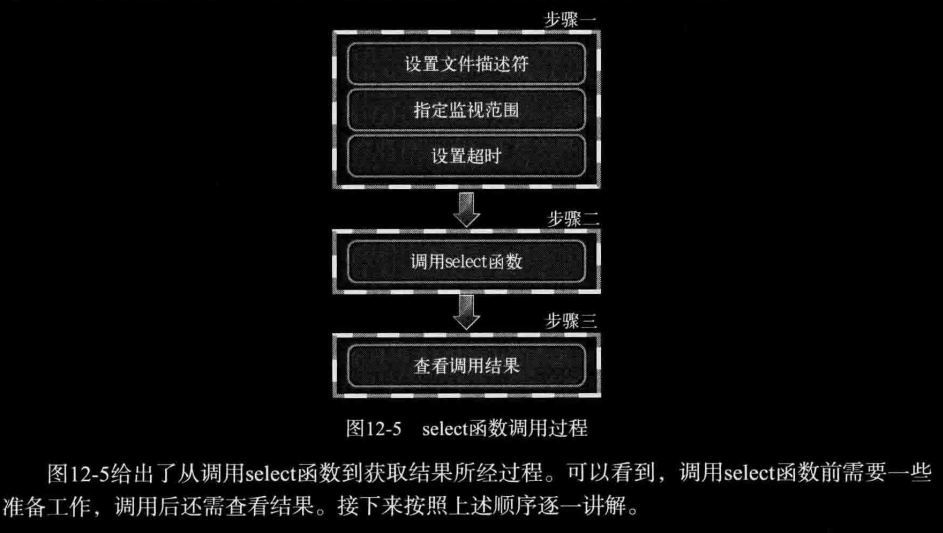
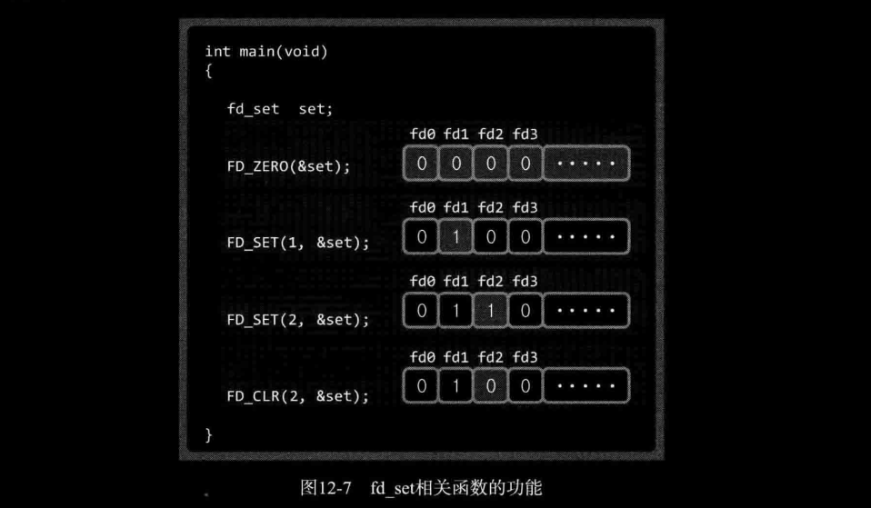
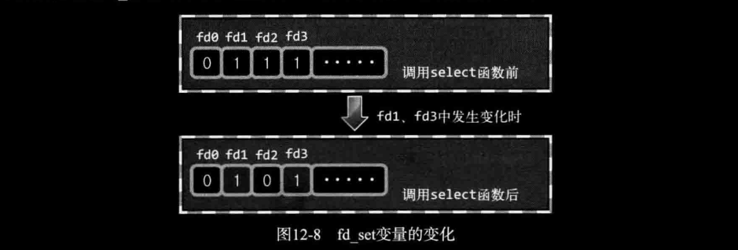

# ch12 I/O复用

本章将讨论并发服务器的第二种实现方法———基于I/O复用（Multiplexing）的服务器端构建。

## 1. 基于I/O复用的服务器端

### *1. 多进程服务器端的缺点*

简言之，创建进程的代价太大，这需要大量的运算和内存空间，由于每个进程都具有独立的内存空间，所以相互间的数据交换也要求采用相对复杂的方法（IPC属于相对复杂的方法）。

### *2. 理解复用*

简言之，就是在一个通信频道中传递多个数据（信号）的技术。时分、频分。。。略

###  *3. 复用技术在服务器端的应用*

服务器端引用复用技术可以减少所需进程数。为便于比较，先给出第10章的多进程服务器模型。如下图所示，


引入复用技术后，可以减少进程数。重要的是，无论连接多少个客户端，提供服务的进程只有一个。


## 2. 理解 `select` 并实现服务器端

运用 `select` 函数是最具代表性的实现复用服务器端方法。Windows平台下也有同名函数提供相同功能，因此具有良好的移植性。

### *1. `select` 函数的功能和调用顺序*

使用 `select` 函数时可以将多个文件描述符集中到一起统一监视，项目如下：

- 是否存在套接字接收数据？
- 无需阻塞传输的数据的套接字有哪些？
- 哪些套接字发生了异常？

> 提示： 监视项称为事件（event）。发生了监视项对应情况时，称 "发生了事件"。这是最常见的表达。

`select` 函数的调用方法和顺序如下：



### *2. 设置文件描述符*

利用 `select` 函数可以同时监视多个文件描述符。当然，监视文件描述符也可视为监视套接字。此时首先需要将要监视的文件描述符集中到一起。集中时也要按照监视项（接收、传输、异常）进行区分，即按照上述3种监视项分成3类。  

使用 `fd_set` 数组变量执行此操作，如下图所示，该数组是存有0和1的位数组。


针对 `fd_set` 变量的操作都是以位为单位进行的，在该变量中注册和更改值的操作都由以下宏完成。

- FD_ZERO(fd_set* fdset)：将 *fdset* 变量的所有位初始化为0。
- FD_SET(int fd, fd_set* fdset)：在参数 *fdset* 指向的变量中注册文件描述符 *fd* 的信息。
- FD_CLR(int fd, fd_set* fdset)：在参数 *fdset* 指向的变量中清除文件描述符 *fd* 的信息。
- FD_ISSET(int fd, fd_set* fdset)：若参数 *fdset* 指向的变量中包含文件描述符 *fd* 的信息，则返回真。

这些函数的功能如下图所示，无须赘述。



### *3. 设置检查（监视）范围及超时*

下面讲解图12-5中步骤一的剩余内容，在此之前先简单介绍 `select` 函数。

```c
#include <sys/select.h>
#include <sys/time.h>
int select(int nfds, fd_set *readfds, fd_set *writefds,
                  fd_set *exceptfds, struct timeval *timeout);
// 发生错误时返回-1，超时返回0.因发生关注的事件返回时，返回发生事件的文件描述符数。
```

- *nfds* ：监视对象文件描述符的数量
- *readset* ：将所有关注 "是否存在待读取数据" 的文件描述符注册到 *fd_set* 型变量，并传递其地址值。
- *writefds* ：将所有关注 "是否可传输无阻塞数据" 的文件描述符注册到 *fd_set* 型变量，并传递其地址值
- *exceptfds* ：将所有关注 "是否发生异常" 的文件描述符注册到 *fd_set* 型变量，并传递其地址值。
- *timeout* ：调用 `select` 函数后，为防止陷入无限阻塞的状态，传递超时信息

`select` 函数要求通过第一个参数传递监视对象文件描述符的数量。因此，需要得到注册在 *fd_set* 变量中的文件描述符数。每次新建文件描述符时，其值都会增1。故只需要将最大的文件描述符值加1再传递到 `select` 函数即可。加1是因为文件描述符的值从0开始。

`select` 函数的超时时间与最后一个参数有关，其中 `timeval` 结构体定义如下：

```c
struct timeval 
{
    long    tv_sec;         /* seconds */
    long    tv_usec;        /* microseconds */
};
```

本来 `select` 函数只有在监视的文件描述符发生变化时才返回。如果未发生变化，就会进入阻塞状态。指定超时时间以防止无限期阻塞。如果不想设置超时，则传递NULL即可。

### *4. 调用 `select` 函数后查看结果*

`select` 函数返回正整数时，怎样获知哪些文件描述符发生了变化？向 `select` 函数的第二到第四个参数传递的 *fd_set* 变量中将产生如下的变化。



由上图可知，`select` 函数调用完成后，向其传递的 *fd_set* 变量中将发生变化。原来为1的所有位均变为0，但发生变化的文件描述符对应位除外。因此，值仍为1的位置上的文件描述符发生了变化。

### *5. `select` 函数调用示例*

[select.c](./select.c)

```c
lxc@Lxc:~/C/tcpip_src/ch12-IO复用$ cat -n select.c | sed 's/    //;s/\t/ /'
 1 #include <stdio.h>
 2 #include <unistd.h>
 3 #include <sys/time.h>
 4 #include <sys/select.h>
 5 
 6 #define BUF_SIZE 30
 7 
 8 int main(int argc, char* argv[])
 9 {
10     fd_set reads, temps;
11     int result, str_len;
12     char buf[BUF_SIZE];
13     struct timeval timeout;
14 
15     FD_ZERO(&reads);
16     FD_SET(0, &reads);
17 
18     while(1)
19     {
20         temps = reads;  
21         timeout.tv_sec = 5;
22         timeout.tv_usec = 0;
23         result = select(1, &temps, 0, 0, &timeout);
24         if(result == -1)
25         {
26             puts("select() error!");
27             break;
28         }
29         else if(result == 0)
30         {
31             puts("Time-out!");
32         }
33         else
34         {
35             if(FD_ISSET(0, &temps))
36             {
37                 str_len = read(0, buf, BUF_SIZE);
38                 buf[str_len] = 0;
39                 printf("Message from console: %s\n", buf);
40             }
41         }
42     }
43 
44     return 0;
45 }
```

- 第 20 行：将准备好的 *fd_set* 变量 *reads* 的内容复制到 *temps* 变量，因为之前讲过，调用 `select` 函数后，除发生变化的文件描述符对应位外，剩下的所有位将初始化为0。因此，为了记住初始值，必须经过这种复制过程。这是使用 `select` 函数的通用方法，希望各位牢记。
- 第 21、22 行：调用 `select` 函数后，结构体 `timeval` 的成员 `tv_sec` 和 `tv_usec` 的值将被替换为超时前剩余的时间。因此每次调用 `select` 函数前，都需要初始化 `timeval` 结构体变量。

```bash
lxc@Lxc:~/C/tcpip_src/ch12-IO复用$ bin/select 
123
Message from console: 123

321
Message from console: 321

Time-out!
Time-out!
6qw
Message from console: 6qw
```

### *6. 实现I/O复用服务器端*

[echo_selectserv.c](./echo_selectserv.c)

```bash
lxc@Lxc:~/C/tcpip_src/ch12-IO复用$ bin/echo_selectserver 9999
Connected client: 4
Connected client: 5
Closed client: 4
Closed client: 5
^C

lxc@Lxc:~/C/tcpip_src/ch12-IO复用$ bin/echo_mpclient 127.0.0.1 9999
qwe
Message from server: qwe

q

lxc@Lxc:~/C/tcpip_src/ch12-IO复用$ bin/echo_mpclient 127.
0.0.1 9999
123
Message from server: 123

q
```