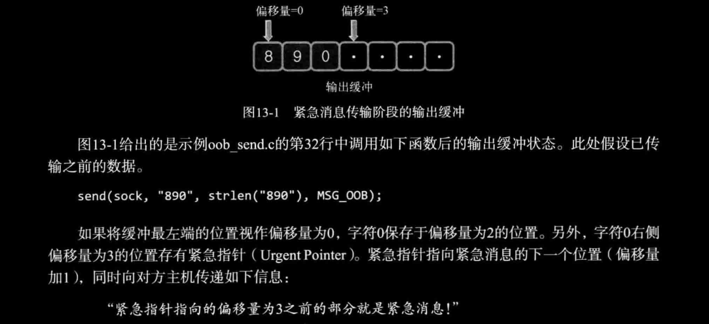

# ch13 多种I/O函数

## 1. `send` & `recv` 函数

### *1. Linux中的 `send` & `recv`*

```c
NAME
       send, sendto, sendmsg - send a message on a socket
SYNOPSIS
       #include <sys/types.h>
       #include <sys/socket.h>
       ssize_t send(int sockfd, const void *buf, size_t len, int flags);
    // 成功时返回发送的字节数，失败时返回-1。
    //    ssize_t sendto(int sockfd, const void *buf, size_t len, int flags,
                    //   const struct sockaddr *dest_addr, socklen_t addrlen);
    //    ssize_t sendmsg(int sockfd, const struct msghdr *msg, int flags);
```

- *sockfd* ：表示与数据传输对象的连接的套接字文件描述符
- *buf* ：保存待传输数据的缓冲地址值
- *len* ：待传输的字节数
- *flags* ：传输数据时指定的可选项信息

```c
NAME
       recv, recvfrom, recvmsg - receive a message from a socket
SYNOPSIS
       #include <sys/types.h>
       #include <sys/socket.h>
       ssize_t recv(int sockfd, void *buf, size_t len, int flags);
    // 成功时返回接收到的字节数（收到EOF时返回0），失败时返回-1
    //    ssize_t recvfrom(int sockfd, void *buf, size_t len, int flags,
    //                     struct sockaddr *src_addr, socklen_t *addrlen);
    //    ssize_t recvmsg(int sockfd, struct msghdr *msg, int flags);
```

- *sockfd* ：表示数据接收对象的连接的套接字文件描述符
- *buf* ： 表示接收数据的缓冲地址值
- *len* ：可接收的最大字节数
- *flags* ：接收数据时指定的可选项信息

可选项可以通过位或同时传递多个信息。下表展示了部分可选项信息。

|可选项(Option)|含义|send|recv|
| :--------------: | :---------------------------------------------: | :--: | :---: |
|MSG_OOB|用于传输带外数据（out-of-band data）|1|1|
|MSG_PEEK|验证输入缓冲中是否存在接收的数据|0|1|
|MSG_DONTROUTE|数据传输过程中，不参照路由表，在本地网络中寻找目的地|1|0|
|MSG_DONTWAIT|调用I/O函数时不阻塞，用于使用非阻塞（Non-blocking）I/O|1|1|
|MSG_WAITALL|防止函数返回，直接接收全部请求的字节数|0|1|

在上表中，1表示该函数支持该可选项，0表示不支持。为了方便这样列到了一起。不同操作系统中对上述可选项的支持也不同。

### *2. MSG_OOB 发送紧急消息*

[oob_send.c](./oob_send.c)

```c
lxc@Lxc:~/C/tcpip_src/ch13-多种IO函数$ cat -n oob_send.c | sed 's/    //;s/\t/ /'
 1 #include <stdio.h>
 2 #include <unistd.h>
 3 #include <stdlib.h>
 4 #include <string.h>
 5 #include <sys/socket.h>
 6 #include <arpa/inet.h>
 7 
 8 #define BUF_SIZE 30
 9 void error_handling(char *message);
10 
11 int main(int argc, char *argv[])
12 {
13     int sock;
14     struct sockaddr_in recv_adr;
15 
16     if (argc != 3)
17     {
18         printf("Usage : %s <IP> <port>\n", argv[0]);
19         exit(1);
20     }
21 
22     sock = socket(PF_INET, SOCK_STREAM, 0);
23     memset(&recv_adr, 0, sizeof(recv_adr));
24     recv_adr.sin_family = AF_INET;
25     recv_adr.sin_addr.s_addr = inet_addr(argv[1]);
26     recv_adr.sin_port = htons(atoi(argv[2]));
27 
28     if (connect(sock, (struct sockaddr *)&recv_adr, sizeof(recv_adr)) == -1)
29         error_handling("connect() error!");
30 
31     write(sock, "123", strlen("123"));
32     send(sock, "4", strlen("4"), MSG_OOB);
33     write(sock, "567", strlen("567"));
34     send(sock, "890", strlen("890"), MSG_OOB);
35     close(sock);
36     return 0;
37 }
38 
39 void error_handling(char *message)
40 {
41     fputs(message, stderr);
42     fputc('\n', stderr);
43     exit(1);
44 }
```

- 第 31\~34 行：传输数据。第32和34行紧急传输数据，正常的顺序应该是123、4、567、890，但紧急传输了4和890，因此可知接收顺序也将改变。

[oob_recv.c](./oob_recv.c)

```c
lxc@Lxc:~/C/tcpip_src/ch13-多种IO函数$ cat -n oob_recv.c | sed 's/    //;s/\t/ /'
 1 #include <stdio.h>
 2 #include <unistd.h>
 3 #include <stdlib.h>
 4 #include <string.h>
 5 #include <signal.h>
 6 #include <sys/socket.h>
 7 #include <netinet/in.h>
 8 #include <fcntl.h>
 9 
10 #define BUF_SIZE 30
11 void error_handling(char *message);
12 void urg_handler(int signo);
13 
14 int serv_sock;
15 int clnt_sock;
16 
17 int main(int argc, char *argv[])
18 {
19     struct sockaddr_in serv_addr, clnt_addr;
20     int str_len, state;
21     socklen_t clnt_addr_sz;
22     struct sigaction act;
23     char buf[BUF_SIZE];
24 
25     if (argc != 2)
26     {
27         printf("Usage : %s <port>\n", argv[0]);
28         exit(1);
29     }
30 
31     act.sa_handler = urg_handler;
32     sigemptyset(&act.sa_mask);
33     act.sa_flags = 0;
34 
35     serv_sock = socket(PF_INET, SOCK_STREAM, 0);
36     memset(&serv_addr, 0, sizeof(serv_addr));
37     serv_addr.sin_family = AF_INET;
38     serv_addr.sin_addr.s_addr = htonl(INADDR_ANY);
39     serv_addr.sin_port = htons(atoi(argv[1]));
40 
41     if (bind(serv_sock, (struct sockaddr *)&serv_addr, sizeof(serv_addr)) == -1)
42         error_handling("bind() error");
43     listen(serv_sock, 5);
44 
45     clnt_addr_sz = sizeof(clnt_addr);
46     clnt_sock = accept(serv_sock, (struct sockaddr *)&clnt_addr, &clnt_addr_sz);
47 
48     fcntl(clnt_sock, F_SETOWN, getpid());
49     state = sigaction(SIGURG, &act, 0);
50 
51     while ((str_len = recv(clnt_sock, buf, sizeof(buf), 0)) != 0)
52     {
53         if (str_len == -1)
54             continue;
55         buf[str_len] = 0;
56         puts(buf);
57     }
58     close(clnt_sock);
59     close(serv_sock);
60     return 0;
61 }
62 
63 void urg_handler(int signo)
64 {
65     int str_len;
66     char buf[BUF_SIZE];
67     str_len = recv(clnt_sock, buf, sizeof(buf) - 1, MSG_OOB);
68     buf[str_len] = 0;
69     printf("Urgent message: %s \n", buf);
70 }
71 
72 void error_handling(char *message)
73 {
74     fputs(message, stderr);
75     fputc('\n', stderr);
76     exit(1);
77 }
```

- 第31、49行：收到 `MSG_OOB` 紧急消息时，操作系统将产生 `SIGURG` 信号，并调用信号处理函数。另外需要注意的是，第63行的信号处理函数内部调用了接收紧急消息的 `recv` 函数。

其中第48行的 `fcntl` 函数用于控制文件描述符。该调用语句的含义如下：将文件描述符 recv_sock 指向的套接字拥有者(F_SETOWN)改为 以 `getpid` 函数返回值作为PID的进程。各位或许感觉套接字拥有者的概念有点生疏。操作系统实际创建并管理套接字，所以从严格意义上说，套接字拥有者是操作系统。只是此处所谓的拥有者是指负责套接字所有事务的主体。上述描述可简要概括如下：文件描述符 recv_sock 指向的套接字引发的 `SIGURG` 信号处理进程变为以 `getpid` 函数返回值作为PID的进程。

之前讲过，多个进程可以共同拥有一个套接字的文件描述符。例如，通过调用 `fork` 函数创建子进程并同时复制文件描述符。此时如果发生 `SIGURG` 信号，应该调用哪个进程的信号处理函数呢？应该可以肯定的是，不会调用所有进程的信号处理函数。因此，处理 `SIGURG` 信号时必须指定处理信号的进程，而 `getpid` 函数返回调用此函数的进程ID。上述调用语句指定当前进程为处理 `SIGURG` 信号的主体。该程序中只创建了一个进程，因此，理应由该进程处理 `SIGURG` 信号。

```bash
lxc@Lxc:~/C/tcpip_src/ch13-多种IO函数$ bin/oob_recv 9999
Urgent message: 4 
Urgent message: 0 
123
56789
lxc@Lxc:~/C/tcpip_src/ch13-多种IO函数$ bin/oob_recv 9993
123456789
# 多次运行的结果不一样。。。
```

的确，通过 `MSG_OOB` 可选项传递数据时不会加快数据传输速度，而且通过信号处理函数 `urg_handler` 读取数据时也只能读取1个字节。剩余数据只能通过未设置 `MSG_OOB` 可选项的普通输入函数读取。这是因为TCP不存在真正意义上的 "带外数据"。实际上，`MSG_OOB` 中的OOB是指 out-of-band，而带外数据的真正含义是：通过完全不同的路径传输的数据。即真正意义的Out-of-band需要通过单独的通信路径高速传输数据，但TCP不另外提供，只利用TCP的紧急模式（Urgent mode）进行传输。

### *3. 紧急模式工作原理*

我反正是没听明白书上在讲什么，我复述一遍给你听听吧。

`MSG_OOB` 的真正意义在于督促数据接收对象尽快处理数据，而TCP保持传输顺序的传输特性依然成立。  
“那怎么能称为紧急消息呢？”  
这确实是紧急消息！因为发送消息者是在催促数据处理的情况下传输数据的。急诊患者及时救治需要如下两个条件。

- 迅速入院
- 医院急救

无法把病人送到医院，并不意味着不需要医院进行急救。TCP的紧急消息无法保证及时入院，但可以急救。当然，急救措施应由程序员完成。之前的 *oob_recv* 的运行过程中也传递了紧急消息，这可以通过事件处理函数确认。这就是 `MSG_OOB` 模式数据传输的实际意义。下面给出设置 `MSG_OOB` 可选项状态下的数据传输过程，如下图所示：



也就是说，实际只用1个字节表示紧急消息信息，这一点可以通过下图看的更清楚。


TCP数据包包含更多的内容，但上图中只标注了与我们主题相关的内容。TCP头部中如下两种信息。

- URG=1 ：载有紧急消息的数据包
- URG指针 ：紧急指针位于偏移量为3的位置（在上图中）。

指定 `MSG_OOB` 选项的数据包本身就是紧急数据包，并通过紧急指针表示紧急消息所在位置。但通过图13-2无法得知以下事实：“紧急消息是字符串890，还是90？如若不是，是否为单个字符0？”。  
但这并不重要。如前所述，除紧急指针的前面1个字节外，数据接收方将通过调用常用的输入函数读取剩余部分。换言之，紧急消息的意义在于督促消息处理，而非紧急传输形式受限的消息。

### *4. 检查输入缓冲*

同时设置 `MSG_PEEK` 选项和 `MSG_DONTWAIT` 选项，以验证输入缓冲中是否存在接收的数据。设置 `MSG_PEEK` 选项并调用 `recv` 函数时，即使读取了输入缓冲中的数据也不会删除。因此，该选项通常与 `MSG_DONTWAIT` 合作，用于调用以非阻塞方式验证待读数据存在与否的函数。

[peek_send.c](./peek_send.c) [peek_recv.c](./peek_recv.c)

```bash
lxc@Lxc:~/C/tcpip_src/ch13-多种IO函数$ bin/peek_recv 9999
Buffering 4 bytes: 123
Read again: 123
lxc@Lxc:~/C/tcpip_src/ch13-多种IO函数$ bin/peek_send 127.0.0.1 9999
```

通过运行结果可以验证，仅发送1次的数据被读取了2次，因为第一次调用 `recv` 函数时设置了 `MSG_PEEK` 选项。

## 2. `readv` & `writev` 函数

### *1. 使用 `readv` & `write` 函数*

这两个函数的功能可概括如下：

“对数据进行整合传输及发送的函数。”

也就是说，通过 `writev` 函数可以将分散保存在多个缓冲中的数据一并发送，通过 `readv` 函数可以由多个缓冲分别接收。因此，适当使用这2个函数可以减少I/O函数的调用次数。

```c
SYNOPSIS
       #include <sys/uio.h>
       ssize_t writev(int fd, const struct iovec *iov, int iovcnt);
// 成功时返回发送的字节数，失败时发送-1。
```

- *fd* ：表示数据传输对象的套接字文件描述符。但该函数并不只限于套接字，因此，可以像 `read` 函数一样向其传递文件或标准输出描述符。
- *iov* ：`iovec` 结构体数组的地址值，结构体 `iovec` 中包含待发送数据的位置和大小信息。
- *iovcnt* ：向第2个参数传递的数组长度。

`iovec` 结构体的声明如下：

```c
struct iovec
{
    void *iov_base;	/* Pointer to data.  */
    size_t iov_len;	/* Length of data.  */
};
```

`iovec` 结构体由保存待发送数据的缓冲地址值和实际发送的数据长度信息构成。

*来个例子：*


第一个参数1是文件描述符，因此向控制台输出数据。*ptr* 是存有待发送数据信息的 `iovec` 数组指针。第三个参数为2，因此，从 *ptr* 指向的地址开始，共浏览2个 `iovec` 结构体变量，发送这些指针指向的缓冲数据。

[writev.c](./writev.c)

```bash
lxc@Lxc:~/C/tcpip_src/ch13-多种IO函数$ bin/writev 
ABCDEFG1234567
Write 15 bytes
```

下面介绍 `readv` 函数，它与 `writev` 函数正相反。

```c
SYNOPSIS
       #include <sys/uio.h>
       ssize_t readv(int fd, const struct iovec *iov, int iovcnt);
```

- *fd* ：包含接收数据的文件（或套接字）描述符
- *iov* ：包含数据保存位置和大小信息的 `iovec` 结构体数组的地址值
- *iovcnt* ： 第二个参数中数组的长度

[readv.c](./readv.c)

```bash
lxc@Lxc:~/C/tcpip_src/ch13-多种IO函数$ bin/readv 
I like TCP/IP socket programming~
Read 34 Bytes
First message: I lik
Second message e TCP/IP socket programming~
```

### *2. 合理使用 `readv` & `writev` 函数*

哪种情况适合使用 `writev` 和 `readv` 函数？实际上，能使用该函数的所有情况都适用。例如，需要传输的数据分别位于不同的缓冲（数组）时，需要多次调用 `write` 函数。此时可以通过1次 `writev` 函数替代操作，当然会提高效率。同样，需要将输入缓冲中的数据读入不同位置时，可以不必多次调用 `read` 函数，而是利用1次 `readv` 函数就能大大提高效率。