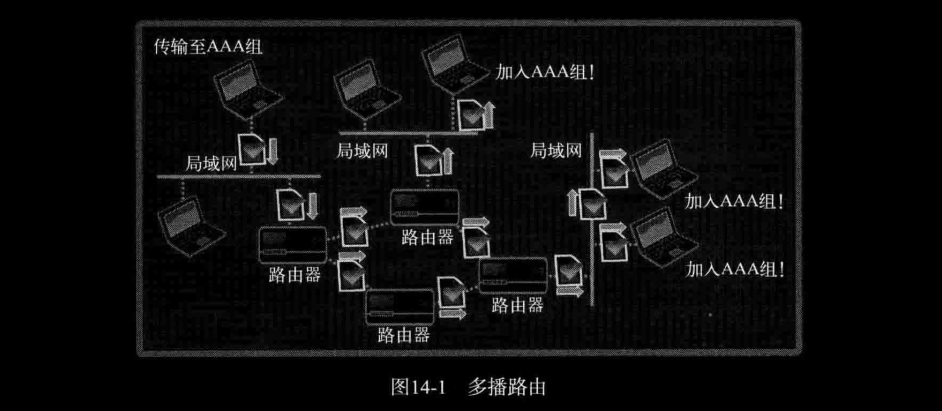

# ch14 多播与广播

向大量客户端发送相同数据时，会对服务器端和网络流量产生负面影响，可以使用多播技术解决该问题。

## 1. 多播

多播（Multicast）方式的数据传输是基于UDP完成的。因此，与UDP服务器端/客户端的实现方式非常接近。区别在于，UDP数据传输以单一目标进行，而多播数据同时传递到加入（注册）特定组的大量主机。换言之，采用多播方式时，可以同时向多个主机传递数据。

### *1. 多播的数据传输方式及流量方面的优点*

- 多播服务器端针对特定多播组，只发送1次数据
- 即使只发送1次数据，该组内的所有客户端都会接收数据
- 多播组数可以在IP地址范围内任意增加
- 加入特定组即可接收发往该多播组的数据

多播组是D类IP地址（224.0.0.0\~239.255.255.255），加入多播组可以理解为通过程序完成如下声明：“在D类IP地址中，我希望接收发往目标239.234.218.234的多播数据。”  
多播是基于UDP完成的，也就是说，多播数据包的格式与UDP数据包相同。只是与一般的UDP数据包不同，向网络传递1个多播数据包时，路由器将复制该数据包并传递到多个主机。像这样，多播需要借助路由器完成。如图14-1所示。



图14-1表示传输至AAA组的多播数据包借助路由器传递到加入AAA组的所有主机的过程。

另外，理论上可以完成多播通信，但不少路由器并不支持多播，或即便支持也因网络拥堵问题而故意阻断多播。因此，为了在不支持多播的路由器中完成多播通信，也会使用隧道（Tunneling）技术（这并非多播程序开发人员需要考虑的问题）。我们只讨论支持多播服务的环境下的编程方法。

### *2. 路由（Routing）和TTL（Time Ti Live，生存时间），以及加入组的方法*

TTL用整数表示，每经过一个路由器就减1，当TTL变为0时，数据包就被销毁。因此，TTL的值设置的过大将影响网络流量。设置的过小也会无法传递到目标。

TTL的设置是通过[第9章](../ch09-套接字的多种可选项/READMD.md#1-套接字的多种可选项)的套接字可选项完成的。与设置TTL相关的协议层为IPPROTO_IP，选项名为 `IP_MULTICAST_TTL`。因此，可以使用如下代码设置TTL。

```c
int send_sock;
int time_live = 64;
......
send_sock = socket(PF_INET, SOCK_DGRAM, 0);
setsockopt(send_sock, IPPROTO_IP, 
        IP_MULTICAST_TTL, (void*)&time_live, sizeof(time_live));
```

加入多播组也通过设置套接字选项完成。加入多播组的相关协议层为IPPROTO_IP，选项名为 `IP_ADD_MEMBERSHIP`。可通过如下代码加入多播组：

```c
int recv_sock;
struct ip_mreq join_addr;
......
recv_sock = socket(PF_INET, SOCK_DGRAM, 0);
join_addr.imr_multiaddr.s_addr = "多播组地址信息";
join_addr.imr_interface.s_addr = "加入多播组的主机地址信息";
setsockopt(recv_sock, IPPROTO_IP, IP_ADD_MEMBERSHIP, (void*)&join_addr, sizeof(join_addr));
......
```

`ip_mreq` 结构体的定义如下：

```c
struct ip_mreq
{
    struct in_addr imr_multiaddr;
    struct in_addr imr_interface;
}
```

[第3章](../ch03-地址族与数据序列/README.md#1-表示ipv4地址的结构体)讲过 `in_addr` 结构体。成员 `imr_multiaddr` 中写入加入的组IP地址。成员 `imr_interface` 是加入该组的套接字所属主机的IP地址，也可以使用 `INADDR_ANY`。

### *3. 实现多播 Sender 和 Receiver*

多播中用 “发送者（Sender）” 和 “接受者（Receiver）” 替代服务器端和客户端。顾名思义，此处的 Sender 是多播数据的发送主体，Receiver 是需要多播组加入过程的数据接收主体。下面是示例，该示例的运行场景如下。

- Sender ：向AAA组广播文件中保存的新闻信息。
- Receiver ：接收传递到AAA组的新闻信息。

[news_sender.c](./news_sender.c) [news_receiver.c](./news_receiver.c)

```bash
lxc@Lxc:~/C/tcpip_src/ch14-多播与广播$ bin/news_sender 127.0.0.1 9190

lxc@Lxc:~/C/tcpip_src/ch14-多播与广播$ bin/news_receiver 127.0.0.1 9190
Although CPAs will not be among the committee`s members, accountants say that the committee will in all likelihood tackle issues that have been previously raised by them with the ministry.
......
```

运行顺序并不重要，因为不像TCP套接字在连接状态下收发数据。只是因为多播属于广播范畴，如果延迟运行Receiver，则无法接收之前传输的多播数据。

> 知识补给站：MBone（Multicast BackBone，多播主干网）。多播是基于MBone这个虚拟网络工作的。各位或许对虚拟网络感到陌生，可以将其理解为 “通过网络中的特殊协议工作的软件概念上的网络”。也就是说，Mbone并非可以触及的物理网络。它是以物理网络为基础，通过软件方法实现的多播通信必备虚拟网络。

## 2. 广播

广播（Broadcast）在 “一次性向多个主机发送数据” 这一点上与多播类似，但传输数据的范围有区别。多播即使在跨越不同网络的情况下，只要加入多播组就能接收数据。相反，广播只能向同一网络中的主机传输数据。

### *1. 广播的理解及实现方法*

广播是向同一网络中的所有主机传输数据的方法。与多播相同，广播也是基于UDP完成的。根据传输数据时使用的IP地址的形式，广播分为如下2种。

- 直接广播（Directed Broadcast）
- 本地广播（Local Broadcast）

二者在代码实现上的差别主要在于IP地址。  
直接广播的IP地址中除了网络地址外，其余主机的地址全部设置为1。例如，希望向网络地址 192.12.34 中的所有主机传输数据时，可以想192.12.34.255传输。换言之，可以采用直接广播的方式向特定区域内所有主机传输数据。  
本地广播中使用的IP地址限定为255.255.255.255。例如，192.32.24网络中的主机向255.255.255.255传输数据时，数据将传递到192.32.24网络中的所有主机。

默认生成的套接字会阻止广播，只需通过如下代码更改默认设置。

```c
int send_sock;
int bcast = 1;
......
send_sock = socket(PF_INET, SOCK_DGRAM, 0);
......
setsockopt(send_sock, SOL_SOCKET, SO_BROADCAST, (void*)&bcast, sizeof(bcast));
```

调用 `setsockopt` 函数，将 `SO_BROADCAST` 选项设置为 `bcast` 变量中的值1。这意味着可以进行数据广播。当然，上述套接字选项只需在Sender中更改，Receiver的实现不需要该过程。

### *2. 实现广播数据的Receiver 和 Sender*

[news_sender_brd.c](./news_sender_brd.c) [news_receiver_brd.c](./news_receiver_brd.c)