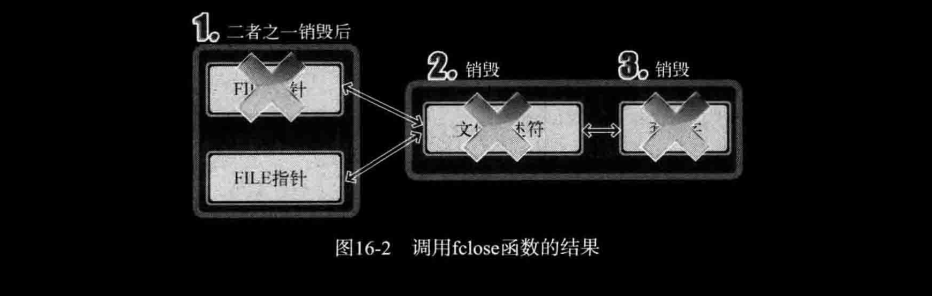
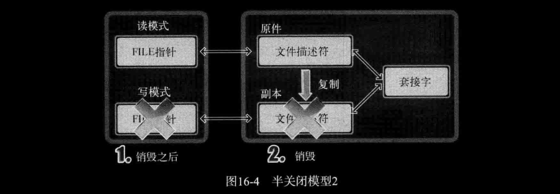

# ch16 关于I/O流分离的其他内容

调用 `fopen` 函数打开文件后可以与文件交换数据，因此说调用 `fopen` 函数后创建了 "流(Stream)"。此处的 "流" 是指 "数据流动"，但通常可以比喻为 "以数据收发为目的的一种桥梁"。希望各位将 "流" 理解为数据收发路径。

## 1. 分离I/O流

### *1. 2次I/O流分离*

我们之前通过2种方法分离过I/O流，第一种是第10章的 "TCP I/O过程分离"。这种方法通过调用 `fork` 函数复制出1个文件描述符，以区分输入和输出中使用的文件描述符。虽然文件描述符本身不会根据输入输出进行区分，但我们分开了2个文件描述符的用途，因此这也属于 "流" 的分离。  
第二种分离是在[第15章](../ch15-套接字和标准IO/echo_stdserv.c)。通过2次 `fdopen` 函数的调用，创建读模式FILE指针（FILE结构体指针）和写模式FILE指针。换言之，我们分离了输入工具和输出工具，因此也可视为 "流" 的分离。

### *2. 分离 "流" 的好处*

第10章的 "流" 分离和第15章的 "流" 分离在目的上有一定差异。首先分析第10章 "流" 分离目的。

- 通过分开输入过程（代码）和输出过程降低实现难度
- 与输入无关的输出操作可以提高速度

接下来给出第15章 "流" 分离的目的。

- 为了将FILE指针按读模式和写模式加以区分
- 可以通过区分读写模式降低实现难度
- 通过区分I/O缓冲提高缓冲性能

### *3. "流" 分离带来的EOF问题*

[sep_serv.c](./sep_serv.c)

```c
lxc@Lxc:~/C/tcpip_src/ch16-关于IO流分离的其他内容$ cat -n sep_serv.c | sed 's/    //;s/\t/ /'
 1 #include <stdio.h>
 2 #include <stdlib.h>
 3 #include <string.h>
 4 #include <unistd.h>
 5 #include <arpa/inet.h>
 6 #include <sys/socket.h>
 7 #define BUF_SIZE 1024
 8 
 9 int main(int argc, char *argv[])
10 {
11 	int serv_sock, clnt_sock;
12 	FILE *readfp;
13 	FILE *writefp;
14 
15 	struct sockaddr_in serv_adr, clnt_adr;
16 	socklen_t clnt_adr_sz;
17 	char buf[BUF_SIZE] = {
18 		0,
19 	};
20 
21 	serv_sock = socket(PF_INET, SOCK_STREAM, 0);
22 	memset(&serv_adr, 0, sizeof(serv_adr));
23 	serv_adr.sin_family = AF_INET;
24 	serv_adr.sin_addr.s_addr = htonl(INADDR_ANY);
25 	serv_adr.sin_port = htons(atoi(argv[1]));
26 
27 	bind(serv_sock, (struct sockaddr *)&serv_adr, sizeof(serv_adr));
28 	listen(serv_sock, 5);
29 	clnt_adr_sz = sizeof(clnt_adr);
30 	clnt_sock = accept(serv_sock, (struct sockaddr *)&clnt_adr, &clnt_adr_sz);
31 
32 	readfp = fdopen(clnt_sock, "r");
33 	writefp = fdopen(clnt_sock, "w");
34 
35 	fputs("FROM SERVER: Hi~ client? \n", writefp);
36 	fputs("I love all of the world \n", writefp);
37 	fputs("You are awesome! \n", writefp);
38 	fflush(writefp);
39 
40 	fclose(writefp);
41 	fgets(buf, sizeof(buf), readfp);
42 	fputs(buf, stdout);
43 	fclose(readfp);
44 	
45 	return 0;
46 }
```

- 第32、33行： 通过clnt_sock保存的文件描述符创建读模式FILE指针和写模式FILE指针
- 第35\~38行：向客户端发送字符串，调用 `fflush` 函数结束发送过程
- 第40、41行：第40行针对写模式FILE指针调用 `fclose` 函数。调用 `fclose` 函数终止套接字时，对方主机将收到EOF。但还剩下读模式FILE指针。那还能不能通过第41行的函数调用接收客户端最后发送的字符串呢？（剧透下，不能）当然，最后的字符串是客户端收到EOF后发送的。

*下面是客户端代码：*

[sep_clnt.c](./sep_clnt.c)

```c
 1 #include <stdio.h>
 2 #include <stdlib.h>
 3 #include <string.h>
 4 #include <unistd.h>
 5 #include <arpa/inet.h>
 6 #include <sys/socket.h>
 7 #define BUF_SIZE 1024
 8 
 9 int main(int argc, char *argv[])
10 {
11 	int sock;
12 	char buf[BUF_SIZE];
13 	struct sockaddr_in serv_addr;
14 
15 	FILE *readfp;
16 	FILE *writefp;
17 
18 	sock = socket(PF_INET, SOCK_STREAM, 0);
19 	memset(&serv_addr, 0, sizeof(serv_addr));
20 	serv_addr.sin_family = AF_INET;
21 	serv_addr.sin_addr.s_addr = inet_addr(argv[1]);
22 	serv_addr.sin_port = htons(atoi(argv[2]));
23 
24 	connect(sock, (struct sockaddr *)&serv_addr, sizeof(serv_addr));
25 	readfp = fdopen(sock, "r");
26 	writefp = fdopen(sock, "w");
27 
28 	while (1)
29 	{
30 		if (fgets(buf, sizeof(buf), readfp) == NULL)
31 			break;
32 		fputs(buf, stdout);
33 		fflush(stdout);
34 	}
35 
36 	fputs("FROM CLIENT: Thank you! \n", writefp);
37 	fflush(writefp);
38 	fclose(writefp);
39 	fclose(readfp);
40 	
41 	return 0;
42 }
```

- 第25、26行：为了调用标准I/O函数，创建读模式和写模式FILE指针。
- 第30行：收到EOF时，`fgets` 函数将返回NULL指针。因此，添加 `if` 语句使收到NULL时退出循环。
- 第36行：通过该行语句向服务器端发送最后的字符串。当然，该字符串是在收到服务器端的EOF后发送的。

*下面进行验证：*

```bash
lxc@Lxc:~/C/tcpip_src/ch16-关于IO流分离的其他内容$ bin/sep_serv 9090
lxc@Lxc:~/C/tcpip_src/ch16-关于IO流分离的其他内容$ 

lxc@Lxc:~/C/tcpip_src/ch16-关于IO流分离的其他内容$ bin/sep_clnt 127.0.0.1 9090
FROM SERVER: Hi~ client? 
I love all of the world 
You are awesome! 
```

*得出结论：*

"服务器端未能接收最后的字符串!"

很容易判断其原因：sep_serv.c 示例的第40行调用的 `fclose` 函数完全终止了套接字，而不是半关闭。以上就是需要通过本章解决的问题。半关闭在多种情况下都非常有用，各位必须能够针对 `fdopen` 函数调用时生成的FILE指针进行半关闭操作。

## 2. 文件描述符的复制和半关闭

### *1. 终止 "流" 时无法半关闭的原因*

图16-1描述的是sep_serv.c示例中的2个FILE指针、文件描述符及套接字之间的关系。


从图16-1中可以看到，实例 sep_serv.c 中的读模式FILE指针和写模式FILE指针都是基于同一文件描述符创建的。因此，针对任意一个FILE指针调用 `fclose` 函数时都会关闭文件描述符，也就终止套接字，如图16-2所示。



从图16-2中可以看到，销毁套接字再也无法进行数据交换。那如何进入可以输入但无法输出的半关闭状态呢？其实很简单，如图16-3所示，创建FILE指针前先复制文件描述符即可。


如图16-3所示，复制后另外创建一个文件描述符，然后利用各自的文件描述符生成读模式FILE指针和写模式FILE指针。这就为半关闭准备好了环境，因为套接字与文件描述符之间有如下关系：

***"销毁所有文件描述符后才能销毁套接字"***

也就是说，针对写模式FILE指针调用 `fclose` 函数时，只能销毁与该FILE指针相关的文件描述符，无法销毁套接字，参考图16-4。



如图16-4所示，调用 `fclose` 函数后还剩1个文件描述符，因此没有销毁套接字。那此时的状态是否为半关闭状态？不是！！图16-3中讲过，只是准备好了半关闭环境。要进入真正的半关闭状态还需要特殊处理。"图16-4好像已经进入半关闭状态了啊？" 仔细观察，还剩一个文件描述符呢，而且该文件描述符可以同时进行IO（你的FILE指针是读模式，但不妨碍文件描述符可以进行IO啊，我甚至还能再复制文件描述符，然后再搞一个写模式FILE指针呢）。***因此，不但没有发送EOF，而且仍然可以利用文件描述符进行输出。*** 稍后介绍发送EOF并进入半关闭状态的方法，在这之前我们先讲讲如何复制文件描述符，之前的 `fork` 不在考虑范围内。

### *2. 复制文件描述符*

此处讨论的复制并非针对整个进程，而是在同一进程内完成描述符的复制，如图16-5所示。


图16-5给出的是同一进程内存在2个文件描述符可以同时访问文件的情况。当然，文件描述符的值不能重复，因此各使用5和7的整数值，为了形成这种结构需要复制文件描述符。此处的复制具有如下的含义：

"为了访问同一文件或套接字，创建另一个文件描述符"

通常的复制很容易让人理解为将包括文件描述符整数值在内的所有内容的复制，而此处的复制则不同。

### *3. `dup` & `dup2`*

```c
SYNOPSIS
       #include <unistd.h>
       int dup(int oldfd);
       int dup2(int oldfd, int newfd);
// 成功时返回复制的文件描述符，失败时返回-1。
```

- *oldfd* ：需要复制的文件描述符
- *newfd* ：明确指定的文件描述符整数值

`dup2` 函数明确指定复制的文件描述符整数值。向其传递大于0且小于进程能生成的最大文件描述符值时，该值将成为复制出的文件描述符值。

[dup.c](./dup.c)

```bash
lxc@Lxc:~/C/tcpip_src/ch16-关于IO流分离的其他内容$ bin/dup 
cfd1: 3 cfd2: 7
Hi~
It's a nice day~~
Hi~
```

### *4. 复制文件描述符后 "流" 的分离*

下面通过服务器端的半关闭状态接收客户端最后发送的字符串。

[sep_serv2.c](./sep_serv2.c)

```c
 1 #include <stdio.h>
 2 #include <stdlib.h>
 3 #include <string.h>
 4 #include <unistd.h>
 5 #include <arpa/inet.h>
 6 #include <sys/socket.h>
 7 #define BUF_SIZE 1024
 8 
 9 int main(int argc, char *argv[])
10 {
11 	int serv_sock, clnt_sock;
12 	FILE * readfp;
13 	FILE * writefp;
14 	
15 	struct sockaddr_in serv_adr, clnt_adr;
16 	socklen_t clnt_adr_sz;
17 	char buf[BUF_SIZE]={0,};
18 
19 	serv_sock=socket(PF_INET, SOCK_STREAM, 0);
20 	memset(&serv_adr, 0, sizeof(serv_adr));
21 	serv_adr.sin_family=AF_INET;
22 	serv_adr.sin_addr.s_addr=htonl(INADDR_ANY);
23 	serv_adr.sin_port=htons(atoi(argv[1]));
24 	
25 	bind(serv_sock, (struct sockaddr*) &serv_adr, sizeof(serv_adr));
26 	listen(serv_sock, 5);
27 	clnt_adr_sz=sizeof(clnt_adr); 
28 	clnt_sock=accept(serv_sock, (struct sockaddr*)&clnt_adr,&clnt_adr_sz);
29 	
30 	readfp=fdopen(clnt_sock, "r");
31 	writefp=fdopen(dup(clnt_sock), "w");
32 	
33 	fputs("FROM SERVER: Hi~ client? \n", writefp);
34 	fputs("I love all of the world \n", writefp);
35 	fputs("You are awesome! \n", writefp);
36 	fflush(writefp);
37 	
38 	shutdown(fileno(readfp), SHUT_WR); // 注意这一行，也可以改成下面注释的那一行。
39 	// shutdown(fileno(writefp), SHUT_WR);
40 	fclose(writefp);
41 	
42 	fgets(buf, sizeof(buf), readfp); fputs(buf, stdout); 
43 	fclose(readfp);
44 	return 0;
45 }
```

- 第30、31行：通过 `fdopen` 函数生成FILE指针。特别是第31行针对 `dup` 函数的返回值生成FILE指针，因此函数调用后进入图16-3的状态。
- 第38行：针对 `fileno` 函数返回的文件描述符调用 `shutdown` 函数。***因此，服务器端进入半关闭状态，并向客户端发送EOF。这一行就是之前所说的发送EOF的方法。调用 `shutdown` 函数时，无论复制出多少文件描述符，套接字都会进入半关闭状态，同时传递EOF。***

```bash
lxc@Lxc:~/C/tcpip_src/ch16-关于IO流分离的其他内容$ bin/sep_serv2 9999
FROM CLIENT: Thank you! 
lxc@Lxc:~/C/tcpip_src/ch16-关于IO流分离的其他内容$ bin/sep_clnt 127.0.0.1 9999
FROM SERVER: Hi~ client? 
I love all of the world 
You are awesome! 
```

运行结果证明了服务器端在半关闭状态下向客户端发送了EOF。通过该示例希望各位掌握一点：

***无论复制出多少文件描述符，均应调用 `shutdown` 函数发送EOF并进入半关闭状态***

第10章的[echo_mpclient.c](../ch10-多进程服务器端/echo_mpclient.c)示例运用过 `shutdown` 函数的这种功能，当时通过 `fork` 函数生成了2个文件描述符，并在这种情况下调用了 `shutdown` 函数发送了EOF。