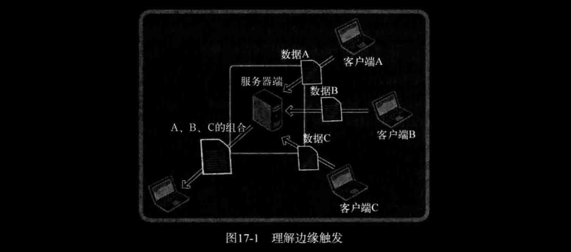

# ch17 优于 select 的 epoll

实现I/O复用的传统方法有 `select` 函数和 `poll` 函数。我们介绍了 `select` 函数的使用方法，但各种原因导致这些方法无法得到令人满意的性能，因此有了Linux下的 `epoll`、BSD的 `kqueue`、Solaris 的 `/dev/poll` 和Windows下的 IOCP 等复用技术。本章将讲解Linux的 `epoll` 技术。

## 1. `epoll` 理解及应用

`select` 方法因为性能问题并不适合以Web服务器端开发为主流的现代开发环境，所以咱们学一学 `epoll` 吧。

### *1. 基于 `select` 的I/O复用技术速度慢的原因*

最主要的两点如下：

- 每次调用 `select` 函数后常见的针对所有文件描述符的循环语句
- 每次调用 `select` 函数时都需要向该函数传递监视对象信息

上述两点可以从第12章示例[echo_selectserv.c](../ch12-IO复用/echo_selectserv.c)的第50、52以及57行代码得到确认。调用 `select` 后，并不是把发生变化的文件描述符单独集中到一起，而是通过观察作为监视对象的 `fd_set` 变量的变化找出发生变化的文件描述符（示例 [echo_selectserv.c](../ch12-IO复用/echo_selectserv.c) 的第57、59行），因此无法避免针对所有监视对象的循环语句。而且，作为监视对象的 `fd_set` 变量会发生变化，所以调用 `select` 函数前应复制并保存原有信息（参考[echo_selectserv.c](../ch12-IO复用/echo_selectserv.c)的第50行），并在每次调用 `select` 函数时传递新的监视对象信息。

相对于循环语句，影响性能的更大障碍是每次传递监视对象信息。因为传递监视对象信息具有如下的含义：

"每次调用 `select` 函数时向操作系统传递监视对象信息"。

应用程序向操作系统传递数据将对程序造成很大的负担，而且无法通过优化代码解决，因此将成为性能上的致命弱点。

"那为何需要把监视对象信息传递给操作系统呢？" 

有些函数不需要操作系统的帮助就能完成功能，而有些则必须借助操作系统。假设各位定义了四则运算相关函数，此时无需操作系统的帮助。但 `select` 函数与文件描述符有关，更准确地说，是监视套接字变化的函数。而套接字是由操作系统管理的，所以 `select` 函数绝对需要借助于操作系统的帮助才能完成功能。 `select` 函数的这一缺点可以通过如下方式弥补：

"仅向操作系统传递1次监视对象，监视范围或内容发生变化时只通知发生变化的事项"

这样就无需每次调用 `select` 函数时都向操作系统传递监视对象信息，但前提是操作系统支持这种处理方式。（每种操作系统支持的程度和方式存在差异）。Linux的支持方式是 `epoll`。

### *2. `select` 也有优点*

本章的 `epoll` 只在Linux下支持，也就是说该I/O复用模型不具有兼容性。相反，大部分操作系统都支持 `select` 函数。只要满足如下两个条件，即使在Linux平台也不应拘泥于 `epoll`。

- 服务器端接入者少
- 程序应具有兼容性

实际并不存在适用于所有情况的模型，各位应理解好各种模型优缺点。

### *3. 实现 `epoll` 时必要的函数和结构体*

能够克服 `select` 函数缺点的 `epoll` 函数具有如下优点，这些优点正好与之前的 `select` 函数缺点相反。

- 无需编写以监视状态变化为目的的针对所有文件描述符的循环语句
- 调用对应于 `select` 函数的 `epoll_wait` 函数时无需每次传递监视对象信息

下面介绍epoll服务器端实现中需要的3个函数。

- `epoll_create` ： 创建保存epoll文件描述符的空间
- `epoll_ctl` ：向空间注册并注销文件描述符
- `epoll_wait` ： 与 `select` 函数类似，等待文件描述符发生变化

`select` 方式中为了保存监视对象文件描述符，直接声明了 `fd_set` 变量。但epoll方式下由操作系统负责保存监视对象文件描述符，因此需要向操作系统请求创建保存文件描述符的空间，此时使用的函数就是 `epoll_create`。  
此外，为了添加和删除监视对象文件描述符，`select` 方式中需要 `FD_SET`、`FD_CLR`函数。但epoll方式中，通过 `epoll_ctl` 函数请求操作系统完成。最后，`select` 方式下调用 `select` 函数等待文件描述符的变化，而epoll中调用 `epoll_wait` 函数。`select` 方式中通过 `fd_set` 变量查看监视对象的状态变化（事件发生与否），而epoll方式中通过如下结构体 `epoll_event` 将发生变化的（发生事件的）文件描述符单独集中到一起。

```c
struct epoll_event
{
    __uint32_t events;
    epoll_data_t data;
}

typedef union epoll_data
{
    void* ptr;
    int fd;
    __uint32_t u32;
    __uint64_t u64;
} epoll_data_t;
```

声明足够大的 `epoll_event` 结构体数组后，传递给 `epoll_wait` 函数时，发生变化的文件描述符信息将被填入该数组。因此，无需像 `select` 函数那样针对所有文件描述符进行循环。

### *4. `epoll_create`*

epoll是从Linux的2.5.44版内核开始引入的。不过各位使用的Linux内核肯定在这个版本之上，无需担心。可以通过如下命令查看自己的Linux内核版本：

```bash
lxc@Lxc:~/C/tcpip_src$ cat /proc/sys/kernel/osrelease 
5.15.0-91-generic
```

下面查看 `epoll_wait` 函数

```c
SYNOPSIS
       #include <sys/epoll.h>
       int epoll_create(int size);
// 成功时返回epoll文件描述符，失败时返回-1
```

- *size* ：epoll实例的大小

调用 `epoll_create` 函数时创建的文件描述符保存空间称为 "epoll例程" 。通过参数 *size* 传递的值并非用来决定epoll例程的大小，而是仅供操作系统参考。

> **提示：** 操作系统将完全忽略传递给 `epoll_create` 的参数
Linux 2.6.8之后的内核将完全忽略传入 `epoll_create` 函数的 *size* 参数，因为内核会根据情况调整 epoll例程的大小。

`epoll_create` 创建的资源与套接字相同，也由操作系统管理。因此，该函数和创建套接字的情况相同，也会返回文件描述符。也就是说，该函数返回的文件描述符主要用于区分epoll例程。需要终止时，与其他文件描述符相同，也要调用 `close` 函数。

### *5. `epoll_ctl`*

生成epoll例程后，应在其内部注册监视对象文件描述符，此时使用 `epoll_ctl` 函数。

```c
SYNOPSIS
       #include <sys/epoll.h>
       int epoll_ctl(int epfd, int op, int fd, struct epoll_event *event);
// 成功时返回0，失败时返回-1
```

- *epfd* ：用于注册监视对象的epoll例程的文件描述符
- *op* ：用于指定监视对象的添加、删除或更改等操作
- *fd* ：需要注册的监视对象文件描述符
- *event* ： 监视对象的事件类型

*下面举几个例子：*

```c
epoll_ctl(A, EPOLL_CTL_ADD, B, C);
```

"在epoll例程A中注册文件描述符B，主要目的是监测参数C中的事件"

```c
epoll_ctl(A, EPOLL_CTL_DEL, B, NULL);
```

"从epoll例程A中删除文件描述符B"

从上述调用语句中可以看到，从监视对象中删除时，不需要监视类型（事件信息），因此向第四个参数传递NULL。 

接下来介绍可以向 `epoll_ctl` 第二个参数传递的常量及含义。

- `EPOLL_CTL_ADD` ： 将文件描述符注册到epoll例程
- `EPOLL_CTL_CEL` ： 从epoll例程中删除文件描述符
- `EPOLL_CTL_MOD` ：更改注册的文件描述符的关注事件发生情况

如前所述，向 `epoll_ctl` 的第二个参数传递 `EPOLL_CTL_DEL` 时，应同时向第四个参数传递NULL。但Linux 2.6.9之前的内核不允许传递NULL。虽然被忽略掉，但也应该传递 `epoll_event` 结构体变量的地址值（本书示例将传递NULL）。其实这是BUG，但也没必要因此怀疑epoll的功能，因为我们使用标准函数中也存在BUG。

下面讲解 `epoll_ctl` 函数的第四个参数，其类型是之前讲过的 `epoll_event` 结构体指针。`epoll_event` 结构体用于保存发生事件的文件描述符集合。

```c
struct epoll_event event;
......
event.events = EPOLLIN; // 发生需要读取数据的情况时
event.data.fd = sockfd;
epoll_ctl(epfd, EPOLL_CTL_ADD, sockfd, &event);
......
```

接下来给出 `epoll_event` 的成员 `events` 中可以保存的常量及所指的事件类型。

- `EPOLLIN` ：需要读取数据的情况
- `EPOLLOUT` ：输出缓冲为空，可以立即发送数据的情况
- `EPOLLPRI` ：收到OOB数据的情况
- `EPOLLRDHUP` ： 断开连接或半关闭的情况，这在边缘触发方式下非常有用
- `EPOLLERR` ： 发生错误的情况
- `EPOLLET` ： 以边缘触发的方式得到事件通知
- `EPOLLONSHOT` : 发生一次事件后，相应文件描述符不再收到事件通知。因此需要向 `epoll_ctl` 函数的第二个参数传递 `EPOLL_CTL_MOD`，再次设置事件。

可以通过位或运算同时传递多个上述参数。

### *6. `epoll_wait`*

最后介绍与 `select` 函数对应的 `epoll_wait` 函数，epoll相关函数中默认最后调用该函数。

```c
SYNOPSIS
       #include <sys/epoll.h>
       int epoll_wait(int epfd, struct epoll_event *events,
                      int maxevents, int timeout);
// 成功时返回发生事件的文件描述符数，失败时返回-1
```

- *epfd* ： 表示事件发生监视范围的epoll例程的文件描述符
- *events* ： 保存发生事件的文件描述符集合的结构体地址值
- *maxevents* ： 第二个参数中可以保存的最大事件数
- *timeout* ：以毫秒为单位的等待时间，传递-1时，一直等待到发生事件。

该函数的调用方式如下。需要注意的是第二个参数所指缓冲需要动态分配。

```c
int event_cnt;
struct epoll_event * ep_events;
......
ep_events = malloc(sizeof(struct epoll_event) * EPOLL_SIZE); // EPOLL_SIZE 是宏常量
......
event_cnt = epoll_wait(epfd, ep_events, EPOLL_SIZE, -1);
```

调用函数后，返回发生事件的文件描述符数，同时在第二个参数所指向的缓冲中保存事件的文件描述符集合。因此，无需像 `select` 那样插入针对所有文件描述符的循环。

### *7. 基于 epoll 的回声服务器端*

[echo_epollserv.c](./echo_epollserv.c)

```c
 1 #include <stdio.h>
 2 #include <stdlib.h>
 3 #include <string.h>
 4 #include <unistd.h>
 5 #include <arpa/inet.h>
 6 #include <sys/socket.h>
 7 #include <sys/epoll.h>
 8 
 9 #define BUF_SIZE 100
10 #define EPOLL_SIZE 50
11 void error_handling(char *buf);
12 
13 int main(int argc, char* argv[])
14 {
15     int serv_sock, clnt_sock;
16     struct sockaddr_in serv_addr, clnt_addr;
17     socklen_t clnt_addr_sz;
18     int str_len;
19     char buf[BUF_SIZE];
20 
21     int epfd, event_cnt;
22     struct epoll_event event;
23     struct epoll_event* ep_events;
24 
25     if(argc != 2)
26     {
27         printf("Usage: %s <port>\n", argv[0]);
28         exit(1);
29     }
30 
31     serv_sock = socket(PF_INET, SOCK_STREAM, 0);
32     if(serv_sock == -1)
33         error_handling("socket() error");
34     memset(&serv_addr, 0, sizeof(serv_addr));
35     serv_addr.sin_family = AF_INET;
36     serv_addr.sin_addr.s_addr = htonl(INADDR_ANY);
37     serv_addr.sin_port = htons(atoi(argv[1]));
38 
39     if(bind(serv_sock, (struct sockaddr*)&serv_addr, sizeof(serv_addr)) == -1)
40         error_handling("bind() error");
41     if(listen(serv_sock, 5) == -1)
42         error_handling("listen() error");
43     
44     epfd = epoll_create(EPOLL_SIZE);
45     ep_events = malloc(sizeof(struct epoll_event) * EPOLL_SIZE);
46 
47     event.events = EPOLLIN;
48     event.data.fd = serv_sock;
49     epoll_ctl(epfd, EPOLL_CTL_ADD, serv_sock, &event);
50 
51     while(1)
52     {
53         event_cnt = epoll_wait(epfd, ep_events, EPOLL_SIZE, -1);
54         if(event_cnt == -1)
55         {
56             puts("epoll_wait() error");
57             break;
58         }
59 
60         for(int i = 0; i < event_cnt; i++)
61         {
62             if(ep_events[i].data.fd == serv_sock)
63             {
64                 clnt_addr_sz = sizeof(clnt_addr);
65                 clnt_sock = accept(serv_sock,
66                                    (struct sockaddr *)&clnt_addr, &clnt_addr_sz);
67                 if(clnt_sock == -1)
68                     error_handling("accept() error");
69 
70                 event.events = EPOLLIN;
71                 event.data.fd = clnt_sock;
72                 epoll_ctl(epfd, EPOLL_CTL_ADD, clnt_sock, &event);
73                 printf("Connected client: %d\n", clnt_sock);
74             }
75             else
76             {
77                 str_len = read(ep_events[i].data.fd, buf, BUF_SIZE);
78                 if(str_len == 0)
79                 {
80                     epoll_ctl(epfd, EPOLL_CTL_DEL, ep_events[i].data.fd, NULL);
81                     close(ep_events[i].data.fd);
82                     printf("Closed client: %d\n", ep_events[i].data.fd);
83                 }
84                 else
85                 {
86                     write(ep_events[i].data.fd, buf, str_len);
87                 }
88             }
89         }
90     }
91     close(serv_sock);
92     close(epfd);
93 
94     return 0;
95 }
96 
97 void error_handling(char *buf)
98 {
99 	    fputs(buf, stderr);
100 	fputc('\n', stderr);
101 	exit(1);
102}
```

之前解释过关键代码，而且程序结构与 `select` 方式没有区别，故没有代码说明。如果你有些地方难以理解，说明未掌握本章之前的内容和 `select` 模型，建议复习。

## 2. 条件触发和边缘触发

### *1. 条件触发和边缘触发的区别在于发生事件的时间点*

- 条件触发方式中，只要输入缓冲中有数据就会一直通知该事件。
- 边缘触发方式中输入缓冲收到数据时仅注册1次该事件，即使输入缓冲中还留有数据，也不会再进行注册。

条件触发更准确的说法是水平触发吧，目前我还没看过其它书，但作为ee的学生，水平触发和边沿触发还是很清楚的。

### *2. 掌握条件触发的事件特性*

epoll默认以条件触发方式工作。下面看个例子。

[echo_EPLTserv.c](./echo_EPLTserv.c)

该示例与之前的 echo_epollserv.c 之间的差异如下：

- 将调用 `read` 函数时使用的缓冲大小缩减为4个字节（第10行）
- 插入验证 `epoll_wait` 函数调用次数的语句（第60行）

减少缓冲大小是为了阻止服务器端一次性读取接收的数据。换言之，调用 `read` 函数后，输入缓冲中仍有数据需要读取。而且会因此注册新的事件并从 `epoll_wait` 函数返回时将循环输出 "return epoll_wait" 字符串。

```bash
lxc@Lxc:~/C/tcpip_src/ch17-优于select的epoll$ bin/echo_EPLTserv 9998
return epoll_wait()
Connected client: 5
return epoll_wait()
return epoll_wait()
return epoll_wait()
return epoll_wait()
return epoll_wait()
return epoll_wait()
return epoll_wait()
return epoll_wait()
return epoll_wait()
return epoll_wait()
Closed client: 5

lxc@Lxc:~/C/tcpip_src/ch17-优于select的epoll$ bin/echo_stdclnt 127.0.0.1 9998
Connected...
Input message(q/Q to quit): 123
Message from server: 123

Input message(q/Q to quit): It's my life.I am your father!
Message from server: It's my life.I am your father!

Input message(q/Q to quit): q
```

从运行结果中可以看出，每当收到客户端数据时，都会注册该事件，并因此多次调用 `epoll_wait` 函数。

> **提示：** `select` 模型是条件触发还是边缘触发？
`select` 模型是以条件触发的方式工作的，输入缓冲中如果还剩有数据，肯定会注册事件。

### *3. 边缘触发服务器端实现中必知的两点*

下面讲解边缘触发服务器端的实现方法。在此之前，先说明两点，这些是实现边缘触发的必知内容。

- 通过 `errno` 变量验证错误原因
- 为了完成非阻塞（Non-blocking）I/O，更改套接字特性

Linux的套接字相关函数通过返回-1通知发生了错误。虽然知道发生了错误，但仅凭这些内容无法得知产生错误的原因。因此，为了在发生错误时提供额外的信息，Linux声明了如下全局变量：  

```c
int errno
```

为了访问该变量需要引入 `error.h` 头文件，因为此头文件中有上述变量的 `extern` 声明。另外，每种函数发生错误时，保存到 `errno` 变量中的值都不同，没必要记住所有可能的值。本节只介绍如下类型的错误：

" `read` 函数发现输入缓冲中没有数据可读时返回-1，同时在 `errno` 中保存 `EAGAIN` 常量。"

下面讲解将套接字改为非阻塞方式的方法。Linux提供更改或读取文件属性的如下方法（曾在[第13章](../ch13-多种IO函数/README.md#2-msg_oob-发送紧急消息)使用过）。

```c
NAME
       fcntl - manipulate file descriptor
SYNOPSIS
       #include <unistd.h>
       #include <fcntl.h>
       int fcntl(int fd, int cmd, ... /* arg */ );
// 成功时返回 cmd 参数相关值，失败时返回-1
```

- *fd* ：属性更改目标的文件描述符
- *cmd* ： 表示函数调用的目的

从上述声明中可以看到，`fcntl` 具有可变参数的形式。如果向第二个参数传递 `F_GETFL`，可以获得第一个参数所指的文件描述符属性（int型）。反之，如果传递 `F_SETFL`，可以更改文件描述符属性。若希望将文件（套接字）改为非阻塞模式，需要如下2条语句。

```c
int flag = fcntl(fd, F_FETFL, 0);
fcntl(fd, F_SETFL, flag|O_NONBLOCK);
```

通过第一条语句获取之前设置的属性信息，通过第二条语句在此基础上添加非阻塞 `O_NONBLOCK` 标志。

### *4. 实现边缘触发的回声服务器端*

之所以介绍读取错误原因的方法和非阻塞模式套接字创建方法，原因在于二者都与边缘触发的服务器端实现有密切联系。首先说明为何需要 `errno` 确认错误原因。

"边缘触发方式中，接收数据时仅注册1次该事件"

就因为这种特点，一旦发生输入相关事件，就应该读取输入缓冲中的全部数据。因此需要检验输入缓冲是否为空。

" `read` 函数返回-1，变量 `errno` 中的值为 `EAGAIN` 时，说明没有数据可读。"

既然如此，为何还需要将套接字变成非阻塞模式？边缘触发方式下，以阻塞方式工作的 `read` & `write` 函数有可能引起服务器端长时间停顿。因此，边缘触发方式中一定要采用非阻塞 `read` & `write` 函数。  
接下来给出以边缘触发方式工作的回声服务器端示例。

[echo_EPETserv.c](./echo_EPETserv.c)

```c
 1 #include <stdio.h>
 2 #include <stdlib.h>
 3 #include <string.h>
 4 #include <unistd.h>
 5 #include <fcntl.h>
 6 #include <errno.h>
 7 #include <arpa/inet.h>
 8 #include <sys/socket.h>
 9 #include <sys/epoll.h>
10 
11 #define BUF_SIZE 4
12 #define EPOLL_SIZE 50
13 void setnonblockingmode(int fd);
14 void error_handling(char *buf);
15 
16 int main(int argc, char* argv[])
17 {
18  int serv_sock, clnt_sock;
19  struct sockaddr_in serv_addr, clnt_addr;
20  socklen_t clnt_addr_sz;
21  int str_len;
22  char buf[BUF_SIZE];
23 
24  int epfd, event_cnt;
25  struct epoll_event *ep_events;
26  struct epoll_event event;
27 
28  if(argc != 2)
29  {
30      printf("Usage: %s <port>\n", argv[0]);
31      exit(1);
32  }
33 
34  serv_sock = socket(PF_INET, SOCK_STREAM, 0);
35  if(serv_sock == -1)
36      error_handling("socket() error");
37  memset(&serv_addr, 0, sizeof(serv_addr));
38  serv_addr.sin_family = AF_INET;
39  serv_addr.sin_addr.s_addr = htonl(INADDR_ANY);
40  serv_addr.sin_port = htons(atoi(argv[1]));
41 
42  if(bind(serv_sock, (struct sockaddr*)&serv_addr, sizeof(serv_addr)) == -1)
43      error_handling("bind() error");
44  if(listen(serv_sock, 5) == -1)
45      error_handling("listen() error");
46  
47  epfd = epoll_create(EPOLL_SIZE);
48  event.data.fd = serv_sock;
49  event.events = EPOLLIN;
50  setnonblockingmode(serv_sock);
51  epoll_ctl(epfd, EPOLL_CTL_ADD, serv_sock, &event);
52  ep_events = malloc(sizeof(struct epoll_event) * EPOLL_SIZE);
53 
54  while(1)
55  {
56      event_cnt = epoll_wait(epfd, ep_events, EPOLL_SIZE, -1);
57      if(event_cnt == -1)
58      {
59          puts("epoll_wait() error");
60          break;
61      }
62      puts("return epoll_wait()");
63 
64      for(int i = 0; i < event_cnt; i++)
65      {
66          if(ep_events[i].data.fd == serv_sock)
67          {
68              clnt_addr_sz = sizeof(clnt_addr);
69              clnt_sock = accept(serv_sock, 
70                  (struct sockaddr*)&clnt_addr, &clnt_addr_sz);
71              setnonblockingmode(clnt_sock);
72              if(clnt_sock == -1)
73                  error_handling("aceept() error");
74 
75              event.events = EPOLLIN | EPOLLET;
76              event.data.fd = clnt_sock;
77              epoll_ctl(epfd, EPOLL_CTL_ADD, clnt_sock, &event);
78              printf("Connected client: %d\n", clnt_sock);
79          }
80          else
81          {
82              while (1)
83              {
84                  str_len = read(ep_events[i].data.fd, buf, BUF_SIZE);
85                  if (str_len == 0)
86                  {
87                      epoll_ctl(epfd, EPOLL_CTL_DEL,
88                                ep_events[i].data.fd, NULL);
89                      close(ep_events[i].data.fd);
90                      printf("Close client: %d\n", ep_events[i].data.fd);
91                  }
92                  else if(str_len < 0)
93                  {
94                      if(errno == EAGAIN)
95                          break;
96                  }
97                  else
98                  {
99                      write(ep_events[i].data.fd, buf, str_len);
100                 }
101             }
102         }
103     }
104 }
105 close(serv_sock);
106 close(epfd);
107 
108 return 0;
109 }
110 
111 void setnonblockingmode(int fd)
112 {
113 	int flag=fcntl(fd, F_GETFL, 0);
114 	fcntl(fd, F_SETFL, flag|O_NONBLOCK);
115 }
116 
117 void error_handling(char *buf)
118 {
119 	fputs(buf, stderr);
120 	fputc('\n', stderr);
121 	exit(1);
122 }
```

- 第11行：为了验证边缘触发的工作方式，将缓冲设置为4字节
- 第62行：为了观察事件发生数而添加的输出字符串的语句
- 第75、76行：第75行将 `accept` 函数创建的套接字改为非阻塞模式。第76行向 `EPOLLIN` 添加 `EPOLLET` 标志，将套接字事件注册方式改为边缘触发
- 第92行：`read` 函数返回-1且 `errno` 值为 `EAGAIN` 时，意味着读取了输入缓冲中的全部数据，因此需要通过 `break` 语句跳出循环


```bash
lxc@Lxc:~/C/tcpip_src/ch17-优于select的epoll$ bin/echo_EPETserv 9983
return epoll_wait()
Connected client: 5
return epoll_wait()
return epoll_wait()
return epoll_wait()
Close client: 5
^C

lxc@Lxc:~/C/tcpip_src/ch17-优于select的epoll$ bin/echo_stdclnt 127.0.0.1 9983
Connected...
Input message(q/Q to quit): I like computer programming
Message from server: I like computer programming

Input message(q/Q to quit): Do you like computer programing????
Message from server: Do you like computer programing????

Input message(q/Q to quit): q
```

上述运行结果中需要注意的是，客户端发送消息次数和服务器端 `epoll_wait` 函数调用次数。客户端从请求连接到断开连接共发送了3次数据，服务器端也相应产生了3次事件。

### *5. 条件触发和边缘触发孰优孰劣*

我们从理论和代码的角度充分理解了条件触发和边缘触发，但仅凭这些还无法理解边缘触发相对于条件触发的优点。边缘触发方式可以做到如下这点：

"可以分离接收数据和处理数据的时间点"

虽然比较简单，但非常准确的说明了边缘触发的优点。现阶段给出如下情景帮助大家理解，如图17-1所示。



图17-1的运行流程如下：

1. 服务器端分别从客户端A、B、C接收数据
2. 服务器端按照A、B、C的顺序重新组合收到的数据
3. 组合的数据将发送给任意主机

为了完成该过程，若能按如下流程运行程序，服务器端的实现并不难。

1. 客户端按照A、B、C的顺序连接服务器端，并依次向服务器端发送数据
2. 需要接收数据的客户端应在客户端A、B、C之前连接到服务器端并等待

但现实中可能频繁出现以下这些情况，换言之，以下这些情况更符合实际。

- 客户端C和B正在向服务器发送数据，但A尚未连接到服务器。
- 客户端A、B、C乱序发送数据
- 服务器端收到数据，但要接收数据的目标客户端还未连接到服务器端

因此，即使输入缓冲中收到数据（注册相应事件），服务器端也能决定读取和处理这些数据的时间点，这样就给服务器端的实现带来了巨大的灵活性。

"条件触发中无法区分数据接收的处理吗？"

并非不可能。但在输入缓冲收到数据的情况下，如果不读取（延迟处理），则每次调用 `epoll_wait` 函数时都会产生相应事件。而且事件数会增加，服务器端能承受吗？这在现实中是不可能的（本身并不合理，因此是根本不会做的事）。

从实现模型的角度看，边缘触发更有可能带来高性能，但不能简单地认为 "只要使用边缘触发就一定能提高速度"。