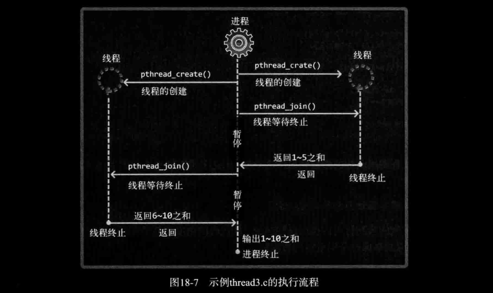

# ch18 多线程服务器端的实现

## 1. 理解线程的概念

### *1. 引入线程的背景*

多进程模型的缺点可概括如下：

- 创建进程的过程会带来一定的开销
- 为了完成进程间数据交换需要特殊的IPC技术
- 上下文切换是多进程模型中最大的开销

线程相比于进程有如下优点：

- 线程的创建和上下文切换相对应的比进程的更快
- 线程间交换数据时无需特殊技术

### *2. 线程和进程的差异*

线程是为了解决如下困惑登场的：

"嘿！为了得到多条代码执行流而复制整个内存区域的负担太重了！"

每个进程的内存空间都由保存全局变量的 "数据区"、向 `malloc` 等函数的动态分配提供空间的堆(Heap)、函数运行时使用的栈(Stack)构成。每个进程都拥有这种独立空间，多个进程的内存结构如图18-1所示。


但如果以获得多个代码执行流为主要目的，则不应像图18-1那样完全分离内存结构，而只需分离栈区域。通过这种方式可以获得如下优势。

- 上下文切换时不需要切换数据区和堆
- 可以利用数据区和堆交换数据

实际上这就是线程。线程为了保持多条代码执行流而隔开了栈区域，因此具有图18-2所示的内存结构。


如图18-2所示，多个线程将共享数据区和堆，为了保持这种结构，线程将在进程内创建并运行。也就是说，进程和线程可以定义为如下形式：

- 进程：在操作系统构成单独执行流的单位
- 线程：在进程构成单独执行流的单位

如果说进程在操作系统内部生成多个执行流，那么线程就在同一进程内部创建多条执行流。因此，操作系统、进程、线程之间的关系可以通过图18-3表示。


## 2. 线程创建及运行

POSIX是为了提高Unix系列操作系统间的移植性而制定的API规范。下面要介绍的线程创建方法也是以POSIX标准为依据的。因此，它不仅适用于Linux，也适用于大部分Unix系列的操作系统。

### *1. 线程的创建和执行流程*

线程具有单独的执行流，因此需要单独定义线程的 `main` 函数，还需要请求操作系统在单独执行流中执行该函数，完成该功能的函数如下。

```c
NAME
       pthread_create - create a new thread
SYNOPSIS
       #include <pthread.h>
       int pthread_create(pthread_t *thread, const pthread_attr_t *attr,
                          void *(*start_routine) (void *), void *arg);
       Compile and link with -pthread.
// 成功时返回0，失败时返回其他值。
```

- *thread* ： 保存新创建线程ID的变量地址值。线程与进程相同，也需要用于区分不同线程的ID。
- *attr* ：用于传递线程属性的参数，传递NULL时，创建默认的线程。
- *start_routine* ：相当于线程的 `main` 函数、在单独执行流中执行的函数地址值（函数指针）。
- *arg* ：通过第三个参数传递调用函数时包含传递参数信息的变量地址值。

*来个示例：*

[thread1.c](./thread1.c)

```bash
lxc@Lxc:~/C/tcpip_src/ch18-多线程服务器端的实现$ bin/thread1 
running thread
running thread
running thread
running thread
running thread
end of main
```

不多说废话了，直接看吧。

```c
NAME
       pthread_join - join with a terminated thread
SYNOPSIS
       #include <pthread.h>
       int pthread_join(pthread_t thread, void **retval);
       Compile and link with -pthread.
// 成功时返回0，失败时返回其他值
```

- *thread* ：该参数值ID的线程终止后才会从该函数返回
- *status* ：保存线程的 `main` 函数返回值的指针变量地址值。

调用该函数的进程（线程）将进入等待状态，直到第一个参数为ID的线程终止为止。而且可以得到该线程的 `main` 函数的返回值。

[thread2.c](./thread2.c)

```bash
lxc@Lxc:~/C/tcpip_src/ch18-多线程服务器端的实现$ bin/thread2 
running thread
running thread
running thread
running thread
running thread
Thread return message: Hello, I'm thread~
```

### *2. 可在临界区内调用的函数*

根据临界区是否引起问题，函数可分为以下2类。

- 线程安全函数（Thread-safe function）
- 非线程安全函数（Thread-unsafe funtion）

线程安全函数被多个线程调用时也不会引起问题，非线程安全函数被同时调用时会引发问题。  
幸运的是大多数标准函数都是线程安全的函数。更幸运的是，我们不需要自己区分线程安全的函数和非线程安全的函数（Windows中同样如此）。因为这些平台在定义非线程安全函数的同时，提供了具有相同功能的线程安全函数。比如，第8章介绍过的如下函数就不是线程安全的函数：

```c
struct hostent *gethostbyname(const char *name);
```

同时提供了线程安全的同一功能的函数。

```c
struct hostent* gethostbyname_r(
    const char* name, struct hostent* result, char* buffer, int buflen,
    int* h_errnop
);
```

线程安全的函数的名称后缀通常为_r（这与Windows平台不同）。既然如此，多个线程同时访问的代码块中应该调用 `gethostbyname_r` 而不是 `gethostbyname` ? 当然！但这种方法会给程序员带来沉重的负担。幸好可以通过如下方法自动将 `gethostbyname` 函数调用改为 `gethostbyname_r` 函数调用！

"声明头文件前定义 `_REENTRANT` 宏"

`gethostbyname` 函数和 `gethostbyname_r` 函数和参数声明都不同，因此，这种宏声明方式有巨大的吸引力。另外，无需为了上述宏定义特意添加 #define 语句，可以在编译时通过添加 `-D_REENTRANT` 选项定义宏。

下面编译线程相关代码时均默认添加 `-D_REENTRANT` 选项。

### *3. 工作（Worker）线程模型*

这个示例将计算1到10的和，但并不是在main函数中进行累加运算，而是创建2个线程，其中一个线程计算1到5的和，另一个线程计算6到10的和，main函数只负责输出运算结果。这种方式的编程模型称为 "工作线程(Worker thread)模型"。计算1到5之和的线程与计算6到10之和的线程将成为main线程管理的工作。最后给出程序执行流程图。如图18-7所示。



[thread3.c](./thread3.c)

```bash
lxc@Lxc:~/C/tcpip_src/ch18-多线程服务器端的实现$ bin/thread3 
Result: 55
```

运行结果是55，虽然正确，但示例本身存在问题。此处存在临界区相关问题，因此再介绍另一示例。该示例与上述示例相似，只是增加了发生临界区相关错误的可能性。

[thread4.c](./thread4.c)

```bash
lxc@Lxc:~/C/tcpip_src/ch18-多线程服务器端的实现$ bin/thread4 
sizeof long long: 8
Result: 152586
lxc@Lxc:~/C/tcpip_src/ch18-多线程服务器端的实现$ bin/thread4 
sizeof long long: 8
Result: 58508
lxc@Lxc:~/C/tcpip_src/ch18-多线程服务器端的实现$ bin/thread4 
sizeof long long: 8
Result: 302218
```

运行结果并不是0！而且每次运行的结果均不同。

## 3. 线程存在的问题和临界区

### *1. 多个线程访问同一变量是问题*

略。。不想阐述，都讲烂了的东西了 :joy::joy:

### *2. 临界区位置*

下面观察示例 thread4.c 的2个main函数。

```c
void* thread_inc(void* arg)
{
    for(int i = 0; i < 5000000; i++)
        num += 1; // 临界区
    return NULL;
}

void* thread_dec(void* arg)
{
    for(int i = 0; i < 5000000; i++)
        num -= 1; // 临界区
    return NULL;
}
```

## 4. 线程同步

前面讨论了线程中存在的问题，接下来就要讨论解决方法——线程同步。

### *1. 同步的两面性*

线程同步用于解决线程访问顺序引发的问题。需要同步的情况可以从如下两方面考虑。

- 同时访问同一内存空间时发生的情况
- 需要指定访问同一内存空间的线程执行顺序的情况

同时访问同一内存空间时发生的情况就是thread4.c中发生的问题。现在讨论第二种情况。这是 "控制线程执行顺序" 的相关内容。假设有A、B两个线程，线程A负责向指定内存写入数据，线程B负责取走该数据。这种情况下，线程A首先应该访问约定的内存空间并保存数据。万一线程B先访问并取走数据，将导致错误结果。像这种需要控制执行顺序的情况也需要使用同步技术。  

稍后将介绍 "互斥量(Mutex)" 和 "信号量(Semaphore)" 这2种同步技术。二者概念上十分接近，只要理解了互斥量就很容易掌握信号量。而且大部分同步技术的原理都大同小异，因此，只要掌握了本章介绍的同步技术，就很容易掌握并运用Windows平台下的同步技术。

### *2. 互斥量*

互斥量是 "Mutual Exclusion" 的简写，表示不允许多个线程同时访问。互斥量是一把优秀的锁，接下来介绍互斥量的创建及销毁函数。

```c
int pthread_mutex_init(pthread_mutex_t *mutex, const pthread_mutexattr_t *mutexattr);
int pthread_mutex_destroy(pthread_mutex_t *mutex);
// 成功时返回0，失败时返回其他值。
```

- *mutex* ：创建互斥量时传递保存互斥量的变量地址值，销毁时传递需要销毁的互斥量地址值。
- *attr* ： 传递即将创建的互斥量属性，没有特别需要指定的属性时传递NULL。

从上述函数声明中也可看到，为了创建相当于锁系统的互斥量，需要声明如下 `pthread_mutex_t` 型变量。

`pthread_mutex_t` mutex;

该变量的地址传递给 `pthread_mutex_init` 函数，用来保存操作系统创建的互斥量（锁系统）。如果不需要配置特殊的互斥量属性，则向第二个参数传递NULL时，可以利用 `PTHREAD_MUTEX_INITIALIZER` 宏进行如下声明：

```c
pthread_mutex_t mutex = PTHREAD_MUTEX_INITIALIZER;
```

但推荐各位尽可能使用 `pthread_mutex_init` 函数进行初始化，因为通过宏进行初始化时很难发现发生的错误。接下来介绍利用互斥量锁住或释放临界区时使用的函数。

```c
int pthread_mutex_lock(pthread_mutex_t *mutex);
int pthread_mutex_unlock(pthread_mutex_t *mutex);
// 成功时返回0，失败时返回其他值。
```

创建好互斥量的前提下，可以通过如下结构保护临界区。

```c
pthread_mutex_lock(&mutex);
// 临界区开始
......
// 临界区结束
pthread_mutex_destroy(&mutex);
```

简言之就是利用lock和unlock函数围住临界区的两端。此时互斥量相当于一把锁，阻止多个线程同时访问。还有一点需要注意，线程退出临界区时，如果忘了调用 `pthread_mutex_unlock` 函数，那么其他为了进入临界区而调用 `pthread_mutex_lock` 函数的线程就无法摆脱阻塞状态。这种情况称为 "死锁(Dead-lock)"，需要格外注意。接下来利用互斥量解决示例 thread4.c 中遇到的问题。

[mutex.c](./mutex.c)

```bash
lxc@Lxc:~/C/tcpip_src/ch18-多线程服务器端的实现$ bin/mutex 
Result: 0
```

从运行结果可以看出，已解决示例thread4.c中的问题。但确认运行结果需要等待较长时间。因为互斥量lock、unlock函数的调用过程要比想象中花费更长的时间。

```c
void *thread_dec(void *arg)
{

    pthread_mutex_lock(&mutex);
    for (int i = 0; i < 5000000; i++)
        num += 1;
    pthread_mutex_unlock(&mutex);

    return NULL;
}
```

以上临界区划分范围较大，但这是考虑到如下优点所做的决定：

"最大限度减少互斥量lock、unlock函数的调用次数。"

你可以将lock与unlock函数的调用放到for循环内，即用锁仅包围临界区，这样会调用5000000次lock与unlock（书上是5千万次，我缩小了10倍），这样你可以感受一下多慢。我们的做法是扩展了临界区，但是变量增加到5000000前不允许其他线程访问，这反而也是一个缺点。其实这里没有正确答案，需要根据不同程序酌情考虑究竟是扩大还是缩小临界区。

### *3. 信号量*

信号量与互斥量很相似，在互斥量的基础上很容易理解信号量。此处只涉及利用 "二进制信号量" 完成 "控制线程顺序" 为中心的同步方法。下面给出信号量创建及销毁方法。

```c
NAME
       sem_init - initialize an unnamed semaphore
SYNOPSIS
       #include <semaphore.h>
       int sem_init(sem_t *sem, int pshared, unsigned int value);
       Link with -pthread.
```

- *sem* ： 创建信号量时传递保存信号量的变量地址值，销毁时传递需要销毁的信号量变量地址值。
- *pshared* ：传递其他值时，创建可由多个进程共享的信号量。传递0时，创建只允许1个进程内部使用的信号量。我们需要完成同一进程内的线程同步，故传递0。
- *value* ： 指定新创建的信号量初始值。

上述函数的 *pshared* 参数超出了我们关注的范围，故默认向其传递0。接下来介绍信号量中相当于互斥量lock、unlock的函数。

```c
#include <semaphore.h>
int sem_post(sem_t *sem);
int sem_wait(sem_t *sem);
```

- *sem* ：传递保存信号量读取值的变量地址值，传递给 `sem_post` 时信号量增1，传递给 `sem_wait` 时信号量减1。

调用 `sem_init` 函数时，操作系统将创建信号量对象，此对象中记录着 "信号量值(Semaphore Value)" 整数。该值在调用 `sem_post` 函数时增1，调用 `sem_wait` 函数时减1。但信号量的值不能小于0，因此，在信号量为0的情况下调用 `sem_wait` 函数时，调用的线程将进入阻塞状态。当然，如果此时有其他线程调用 `sem_post` 时信号量的值将变为1，而原本阻塞的线程可以将该信号量重新减为0并跳出阻塞状态。实际上就是通过这种特性完成对临界区的同步操作，可以通过如下形式同步临界区（假设信号量的初始值为1）。

```c
sem_wait(&sem); // 信号量变为0
// 临界区的开始
......
// 临界区的结束
sem_post(&sem); // 信号量变为1...
```

上述代码结构中，调用 `sem_wait` 函数进入临界区的线程在调用 `sem_post` 函数前不允许其他线程进入临界区。信号量的值在0和1之间跳转，因此，具有这种特性的机制称为 "二进制信号量"。接下来给出信号量的示例，关于控制访问顺序的同步。该示例的场景如下：

"线程A从用户输入得到值后存入全局变量 `num`，此时线程B将取走该值并累加。该过程共进行5次，完成后输出总和并退出程序。"

[semaphore.c](./semaphore.c)

```c
 1 #include <stdio.h>
 2 #include <pthread.h>
 3 #include <semaphore.h>
 4 
 5 void* read(void* arg);
 6 void* accu(void* arg);
 7 static sem_t sem_one;
 8 static sem_t sem_two;
 9 static int num;
10 
11 int main(int argc, char* argv[])
12 {
13     pthread_t id_t1, id_t2;
14     sem_init(&sem_one, 0, 0);
15     sem_init(&sem_two, 0, 1);
16 
17     pthread_create(&id_t1, NULL, read, NULL);
18     pthread_create(&id_t2, NULL, accu, NULL);
19 
20     pthread_join(id_t1, NULL);
21     pthread_join(id_t2, NULL);
22 
23     sem_destroy(&sem_one);
24     sem_destroy(&sem_two);
25 
26     return 0;
27 }
28 
29 void* read(void* arg)
30 {
31     for(int i = 0; i < 5; i++)
32     {
33         fputs("Input num: ", stdout);
34 
35         sem_wait(&sem_two);
36         scanf("%d", &num);
37         sem_post(&sem_one);
38     }
39 
40     return NULL;
41 }
42 
43 void* accu(void* arg)
44 {
45     int sum = 0;
46     for(int i = 0; i < 5; i++)
47     {
48         sem_wait(&sem_one);
49         sum += num;
50         sem_post(&sem_two);
51     }
52     printf("Result: %d\n", sum);
53 
54     return NULL;
55 }
```

- 第14、15行：生成2个信号量，一个信号量的值为0，另一个为1。
- 第35、50行：利用信号量变量 `sem_two` 调用 `wait` 函数和 `post` 函数。这是为了防止在调用 `accu` 的函数的线程还未取走数据的情况下，调用 `read` 函数的线程覆盖原值。
- 第37、46行：利用信号量变量 `sem_one` 调用 `wait` 和 `post` 函数。这是为了防止调用 `read` 函数的线程写入新值前，`accu` 函数再取走旧值。

```bash
lxc@Lxc:~/C/tcpip_src/ch18-多线程服务器端的实现$ bin/semaphore 
Input num: 12
Input num: 13
Input num: 14
Input num: 15
Input num: 16
Result: 70
```

## 5. 线程的销毁和多线程并发服务器端的实现

### *1. 销毁线程的3种方法*

Linux线程不是在首次调用的线程 `mian` 函数返回时自动销毁，所以用如下2种方法之一加以明确。否则由线程创建的内存空间将一直存在。

- 调用 `pthread_join` 函数
- 调用 `pthread_detach` 函数

之前调用过 `pthread_join` 函数。调用该函数时，不仅会等待线程终止，还会引导线程销毁。但该函数的问题是，线程终止前，调用该函数的线程将进入阻塞状态。因此，通常会通过如下函数调用引导线程销毁。

```c
NAME
       pthread_detach - detach a thread
SYNOPSIS
       #include <pthread.h>
       int pthread_detach(pthread_t thread);
       Compile and link with -pthread.
// 成功时返回0，失败时返回其他值。
```

- *thread* ：终止的同时需要销毁的线程ID。

调用上述函数不会引起线程终止或进入阻塞状态，可以通过该函数引导销毁线程创建的内存空间。调用该函数后不能再针对相应线程调用 `pthread_join` 函数，这需要格外注意。虽然还有其他方法在创建线程时可以指定销毁时机，但与 `pthread_detach` 方式相比，结果上没有太大差异，故省略其说明。

### *2. 多线程并发服务器端的实现*

[chat_server.c](./chat_serv.c) [chat_clnt.c](./chat_clnt.c)

```bash
lxc@Lxc:~/C/tcpip_src/ch18-多线程服务器端的实现$ bin/chat_serv 9898
Connected client IP: 127.0.0.1
Connected client IP: 127.0.0.1

lxc@Lxc:~/C/tcpip_src/ch18-多线程服务器端的实现$ bin/chat_clnt 127.0.0.1 9898 lxc
[lsd] hahaha
woshinidie
[lxc] woshinidie
[lsd] woshinidye
wuer
[lxc] wuer
q

lxc@Lxc:~/C/tcpip_src/ch18-多线程服务器端的实现$ bin/chat_clnt 127.0.0.1 9898 lsd
hahaha
[lsd] hahaha
[lxc] woshinidie
woshinidye
[lsd] woshinidye
[lxc] wuer
q
```